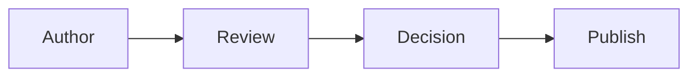

# AGENTS.md

## Purpose

This repository is the shared source of truth for documents used to work with the Insumart team.

It covers:

- Product and technical documents.
- Service and data contracts.
- Architecture and technical decisions.
- Integration guides and operational runbooks.

## Core Rules

- Write in clear, concise English.
- Use short sentences and simple words.
- State facts. Do not guess missing details.
- Verify technical claims against the relevant code, contract, or source document.
- Record open questions and assumptions explicitly.
- Keep changes small and focused on the requested document.
- Do not change an agreed contract or decision without calling out the impact.
- Preserve existing content that is outside the task scope.
- Never include secrets, credentials, personal data, or internal access tokens.

## Document Structure

Each document should include, when relevant:

1. Title and status.
2. Context and problem.
3. Goals and non-goals.
4. Proposed solution or contract.
5. Affected systems and owners.
6. Risks and trade-offs.
7. Rollout, rollback, or migration plan.
8. Open questions.
9. References.

Do not add empty sections only to satisfy this list.

## Contracts

For API, event, and data contracts:

- Define the producer and consumer.
- Define field names, types, required fields, and validation rules.
- Include request, response, or event examples.
- Define errors, retries, timeouts, and idempotency where relevant.
- State compatibility and versioning rules.
- Describe security and data sensitivity.
- Call out breaking changes clearly.
- Include a migration plan for breaking changes.

## Technical Decisions

Use an Architecture Decision Record for important decisions.

Each decision should contain:

- Status: proposed, accepted, superseded, or rejected.
- Context: why a decision is needed.
- Decision: what was selected.
- Options: practical alternatives considered.
- Consequences: benefits, costs, risks, and follow-up work.

Do not rewrite accepted history. Add a new decision that supersedes the old one.

## Diagrams

Use Mermaid for flows, system context, ownership, and dependency views.

- Keep each diagram understandable within 10 seconds.
- Show only details needed for the document.
- Split large diagrams into an overview and smaller detail diagrams.
- Add a short text summary so the document still works without rendering.

## Review Checklist

Before completing a change, confirm:

- The document has a clear purpose and audience.
- Terms and names are consistent.
- Claims are backed by known sources.
- Assumptions and open questions are visible.
- Contract compatibility and migration impact are covered.
- Diagrams match the written content.
- Links and examples are valid.
- No sensitive data is present.

## Agent Workflow

1. Read the full target document and nearby related documents.
2. Inspect referenced contracts or source code before making technical claims.
3. Make the smallest change that satisfies the request.
4. Check terminology, links, examples, and Mermaid syntax.
5. Summarize changed files, key decisions, and unresolved questions.

If required information is missing and would materially change the result, ask for it instead of inventing it.
