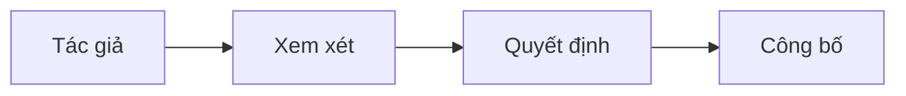

# AGENTS.md

## Mục đích

Kho lưu trữ này là nguồn thông tin chuẩn dùng chung cho các tài liệu phục vụ công việc với đội ngũ Insumart.

Phạm vi gồm:

- Tài liệu sản phẩm và kỹ thuật.
- Hợp đồng dịch vụ và dữ liệu.
- Kiến trúc và quyết định kỹ thuật.
- Hướng dẫn tích hợp và sổ tay vận hành.

## Quy tắc cốt lõi

- Viết tiếng Việt rõ ràng, ngắn gọn.
- Dùng câu ngắn và từ đơn giản.
- Chỉ nêu sự thật. Không đoán thông tin còn thiếu.
- Xác minh nội dung kỹ thuật với mã nguồn, hợp đồng hoặc tài liệu nguồn có liên quan.
- Ghi rõ câu hỏi mở và giả định.
- Giữ thay đổi nhỏ và tập trung vào tài liệu được yêu cầu.
- Không thay đổi hợp đồng hoặc quyết định đã thống nhất mà không nêu rõ tác động.
- Giữ nguyên nội dung nằm ngoài phạm vi công việc.
- Không đưa mật khẩu, mã truy cập, dữ liệu cá nhân hoặc thông tin bí mật vào tài liệu.

## Cấu trúc tài liệu

Mỗi tài liệu nên có các phần sau khi phù hợp:

1. Tiêu đề và trạng thái.
2. Bối cảnh và vấn đề.
3. Mục tiêu và nội dung không thuộc phạm vi.
4. Giải pháp hoặc hợp đồng được đề xuất.
5. Hệ thống và bên chịu trách nhiệm bị ảnh hưởng.
6. Rủi ro và đánh đổi.
7. Kế hoạch phát hành, quay lại bản cũ hoặc chuyển dữ liệu.
8. Câu hỏi mở.
9. Tài liệu tham khảo.

Không thêm phần trống chỉ để đáp ứng danh sách này.

## Hợp đồng

Với hợp đồng API, sự kiện và dữ liệu:

- Xác định bên tạo và bên sử dụng.
- Xác định tên trường, kiểu dữ liệu, trường bắt buộc và quy tắc kiểm tra.
- Thêm ví dụ về yêu cầu, phản hồi hoặc sự kiện.
- Xác định lỗi, cách thử lại, thời gian chờ và cách tránh tạo dữ liệu trùng khi gửi lại yêu cầu.
- Nêu cách giữ tương thích và quản lý phiên bản.
- Mô tả bảo mật và mức độ nhạy cảm của dữ liệu.
- Nêu rõ thay đổi phá vỡ tính tương thích.
- Thêm kế hoạch chuyển đổi cho thay đổi không tương thích với bản cũ.

## Quyết định kỹ thuật

Dùng Bản ghi quyết định kiến trúc (ADR) cho các quyết định quan trọng.

Mỗi quyết định cần có:

- Trạng thái: đề xuất, chấp nhận, thay thế hoặc từ chối.
- Bối cảnh: lý do cần đưa ra quyết định.
- Quyết định: phương án được chọn.
- Các phương án: những lựa chọn thực tế đã cân nhắc.
- Hệ quả: lợi ích, chi phí, rủi ro và công việc tiếp theo.

Không viết lại lịch sử đã được chấp nhận. Hãy thêm quyết định mới để thay thế quyết định cũ.

## Sơ đồ

Dùng Mermaid cho luồng, bối cảnh hệ thống, quyền sở hữu và quan hệ phụ thuộc.

- Mỗi sơ đồ phải hiểu được trong vòng 10 giây.
- Chỉ hiển thị chi tiết cần thiết cho tài liệu.
- Chia sơ đồ lớn thành một sơ đồ tổng quan và các sơ đồ chi tiết nhỏ hơn.
- Thêm phần tóm tắt ngắn để tài liệu vẫn dùng được khi không hiển thị sơ đồ.

## Danh sách kiểm tra

Trước khi hoàn tất thay đổi, xác nhận:

- Tài liệu có mục đích và đối tượng đọc rõ ràng.
- Thuật ngữ và tên gọi nhất quán.
- Các nhận định dựa trên nguồn đã biết.
- Giả định và câu hỏi mở được nêu rõ.
- Tính tương thích của hợp đồng và tác động di chuyển đã được xem xét.
- Sơ đồ khớp với nội dung viết.
- Liên kết và ví dụ hợp lệ.
- Không có dữ liệu nhạy cảm.

## Quy trình làm việc của người hỗ trợ

1. Đọc toàn bộ tài liệu cần sửa và các tài liệu liên quan gần đó.
2. Kiểm tra hợp đồng hoặc mã nguồn được tham chiếu trước khi đưa ra nhận định kỹ thuật.
3. Thực hiện thay đổi nhỏ nhất đáp ứng yêu cầu.
4. Kiểm tra thuật ngữ, liên kết, ví dụ và cú pháp Mermaid.
5. Tóm tắt các tệp đã thay đổi, quyết định chính và câu hỏi chưa giải quyết.

Nếu thiếu thông tin có thể làm thay đổi đáng kể kết quả, hãy hỏi thay vì tự suy đoán.
