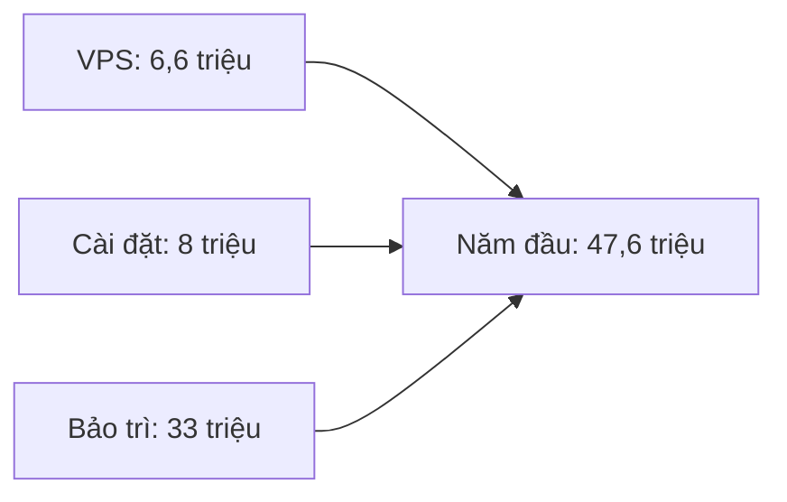

# Chi phí vận hành hệ thống thật

**Trạng thái:** Đề xuất

**Đối tượng đọc:** CEO, chủ sản phẩm và đội kỹ thuật

**Ngày kiểm tra giá:** 26 tháng 9 năm 2026

## Mục đích

Tài liệu này ước tính chi phí chạy hệ thống trong một, hai và ba năm.

Chi phí không gồm làm tính năng mới, kiểm thử sản phẩm hoặc chuyển dữ liệu lớn.

## Phương án đề xuất

Dùng hai VPS Vietnix Cheap 2:

- Một VPS chạy website và ứng dụng.
- Một VPS chạy PostgreSQL.
- Tệp khách hàng tải lên được lưu trên VPS Web.

Cách này giúp lỗi website không ảnh hưởng trực tiếp đến máy chủ cơ sở dữ liệu.

## Các số dùng để tính

- Lưu lượng dự kiến khoảng 600 lượt truy cập mỗi ngày.
- Mỗi VPS có 2 CPU, 4 GB RAM và 40 GB SSD.
- Mỗi VPS được tính ở mức 250.000 VND/tháng, chưa VAT.
- Hai VPS có giá 500.000 VND/tháng, chưa VAT.
- Phí cài đặt ban đầu là 8 triệu VND, trả một lần.
- Phí bảo trì là 2,5 triệu VND/tháng, chưa VAT.
- Công việc ngoài gói là 300.000 VND/giờ cho mọi khung giờ.
- Các bảng dài hạn dùng VAT 10% cho VPS và phí bảo trì.
- Tên miền, công cụ theo dõi miễn phí và Cloudflare Free không phát sinh thêm phí.

Phí cài đặt 8 triệu VND là số tiền trọn gói dùng trong kế hoạch này. Không cộng thêm VAT vào con số đó.

## Các khoản bắt buộc

| Hạng mục | Cách tính |
|---|---|
| Hai VPS | Trả hằng tháng |
| Cài đặt ban đầu | Trả một lần |
| Bảo trì | Trả hằng tháng |
| Tên miền hiện có | Không phát sinh thêm phí |
| Lưu tệp trên VPS Web | Đã gồm trong giá VPS |
| Bản sao lưu hằng tuần của Vietnix | Đã gồm trong giá VPS |
| Công cụ theo dõi tự quản lý | Không mất phí nhà cung cấp |
| Cloudflare Free | Không mất phí |

## Chi phí hai VPS

| Hạng mục | 1 năm | 2 năm | 3 năm |
|---|---:|---:|---:|
| Hai VPS trước VAT | 6 triệu VND | 12 triệu VND | 18 triệu VND |
| VAT 10% | 600.000 VND | 1,2 triệu VND | 1,8 triệu VND |
| **Tổng tiền VPS** | **6,6 triệu VND** | **13,2 triệu VND** | **19,8 triệu VND** |

Giá trên không tính khuyến mãi. Giá thật có thể thấp hơn nếu Vietnix giảm giá khi trả trước.

## Phí cài đặt ban đầu

Phí cài đặt trọn gói là **8 triệu VND**. Phạm vi gồm:

| Công việc | Thời gian dự kiến |
|---|---:|
| Tạo máy chủ và cấp quyền truy cập | 1 giờ |
| Cài đặt bảo mật cho hệ điều hành và tường lửa | 4 giờ |
| Cấu hình Cloudflare, HTTPS và cổng vào website | 4 giờ |
| Cấu hình PostgreSQL | 3 giờ |
| Cấu hình nơi lưu tệp và quyền truy cập | 2 giờ |
| Cấu hình sao lưu và thử khôi phục | 4 giờ |
| Cấu hình theo dõi, nhật ký và cảnh báo | 3 giờ |
| Cấu hình phát hành và quay lại bản cũ | 3 giờ |
| Viết hướng dẫn vận hành và bàn giao | 2 giờ |
| Kiểm tra hệ thống trước khi mở cho khách hàng | 2 giờ |
| Thời gian dự phòng | 4 giờ |
| **Tổng** | **32 giờ** |

Nếu khách hàng yêu cầu thêm việc ngoài danh sách, phần thêm được báo trước và tính 300.000 VND/giờ.

## Phí bảo trì

Phí bảo trì là **2,5 triệu VND/tháng trước VAT**.

| Thời hạn | Trước VAT | VAT 10% | Tổng tiền |
|---|---:|---:|---:|
| 1 tháng | 2,5 triệu VND | 250.000 VND | **2,75 triệu VND** |
| 1 năm | 30 triệu VND | 3 triệu VND | **33 triệu VND** |
| 2 năm | 60 triệu VND | 6 triệu VND | **66 triệu VND** |
| 3 năm | 90 triệu VND | 9 triệu VND | **99 triệu VND** |

Gói bảo trì gồm:

- Theo dõi hai VPS, website và cơ sở dữ liệu.
- Kiểm tra cảnh báo, tài nguyên và bản sao lưu.
- Cập nhật bảo mật theo kế hoạch.
- Thử khôi phục dữ liệu mỗi tháng.
- Diễn tập phục hồi mỗi quý.
- Gửi báo cáo ngắn mỗi tháng.
- Phản hồi trong vòng 8 giờ làm việc đã thống nhất.

Gói không gồm sửa lỗi mã nguồn, làm tính năng, nâng cấp lớn, chuyển dữ liệu lớn, trực 24/7 hoặc xử lý sự cố không giới hạn.

## Tổng ngân sách

Tổng dưới đây gồm hai VPS, cài đặt ban đầu, bảo trì và VAT theo giả định trên.

| Hạng mục | 1 năm | 2 năm | 3 năm |
|---|---:|---:|---:|
| Hai VPS | 6,6 triệu VND | 13,2 triệu VND | 19,8 triệu VND |
| Cài đặt ban đầu | 8 triệu VND | 8 triệu VND | 8 triệu VND |
| Bảo trì | 33 triệu VND | 66 triệu VND | 99 triệu VND |
| **Tổng ngân sách** | **47,6 triệu VND** | **87,2 triệu VND** | **126,8 triệu VND** |

Từ năm thứ hai, không còn phí cài đặt. Chi phí thêm mỗi năm dự kiến là **39,6 triệu VND**, gồm 6,6 triệu tiền VPS và 33 triệu tiền bảo trì.

## Phương án một máy chủ

Phương án này dùng một VPS cho website, ứng dụng, PostgreSQL và tệp.

Các số dùng để tính:

- Cài đặt ban đầu: 7 triệu VND.
- Bảo trì: 2 triệu VND/tháng trước VAT, tương đương 26,4 triệu VND/năm sau VAT.
- Một VPS: 3,3 triệu VND/năm sau VAT.

| Thời hạn | Tổng chi phí |
|---|---:|
| 1 năm | **36,7 triệu VND** |
| 2 năm | **66,4 triệu VND** |
| 3 năm | **96,1 triệu VND** |

Phương án một máy chủ tiết kiệm 10,9 triệu VND trong năm đầu. Đổi lại, khi VPS gặp lỗi, toàn bộ website và cơ sở dữ liệu cùng dừng.

## Chi phí có thể phát sinh

### Công việc ngoài gói

Mọi công việc ngoài gói có cùng đơn giá **300.000 VND/giờ**, kể cả buổi tối, cuối tuần và ngày lễ.

- Chỉ làm sau khi khách hàng đồng ý.
- Tính theo mỗi 30 phút.
- Không cam kết luôn sẵn sàng ngoài giờ.
- Chi phí của nhà cung cấp khác được tính riêng.

Ví dụ, nếu một tháng có 4 giờ phát sinh thì chi phí thêm là **1,2 triệu VND**.

### Trực 24/7

Gói bảo trì không có trực 24/7 và không cam kết phản hồi trong 15 phút. Nếu doanh nghiệp cần mức này, phải dùng hợp đồng riêng hoặc thêm một đơn vị trực chuyên nghiệp.

### Cloudflare Pro

Cloudflare Pro là tùy chọn. Ước tính dùng giá 20 USD/tháng, tỷ giá 27.000 VND/USD và thêm 10% cho thuế cùng biến động tỷ giá.

| Chi phí | 1 năm | 2 năm | 3 năm |
|---|---:|---:|---:|
| Cloudflare Pro | 7,128 triệu VND | 14,256 triệu VND | 21,384 triệu VND |
| Ngân sách bắt buộc | 47,6 triệu VND | 87,2 triệu VND | 126,8 triệu VND |
| **Tổng nếu thêm Cloudflare Pro** | **54,728 triệu VND** | **101,456 triệu VND** | **148,184 triệu VND** |

Cloudflare Free vẫn là lựa chọn mặc định.

## Rủi ro sao lưu

Vietnix cho biết gói VPS có một bản sao lưu tự động mỗi tuần và chỉ giữ bản mới nhất trên máy chủ sao lưu riêng.

Nếu không mua thêm nơi lưu bên ngoài:

- Có thể mất tối đa bảy ngày dữ liệu tệp.
- Có thể chỉ còn một bản sao lưu của Vietnix.
- Sự cố lớn ở Vietnix hoặc tài khoản Vietnix có thể ảnh hưởng cả hệ thống và bản sao lưu.

Chủ doanh nghiệp phải chấp nhận rủi ro này. Nên mua thêm nơi lưu bên ngoài khi dữ liệu đã có giá trị cao.

## Nội dung cần chốt

Chủ doanh nghiệp cần chọn:

- Phương án hai máy chủ hay một máy chủ.
- Thời hạn một, hai hoặc ba năm.
- Khung giờ hỗ trợ.
- Bản sao lưu hằng tuần có đủ hay không.
- Cách duyệt công việc phát sinh.

## Tài liệu tham khảo

- [Các phương án triển khai](../deployments/README.md)
- [Kiến trúc Phương án 1](../deployments/option-1-single-server/architecture.md)
- [Kiến trúc Phương án 2](../deployments/option-2-two-servers/architecture.md)
- [Công việc và chi phí bảo trì](../maintainances/maintenance-work-and-cost.md)
- [Ứng phó sự cố](../maintainances/incident-response.md)
- [Bảng giá VPS Vietnix và bản sao lưu hằng tuần](https://vietnix.vn/vps/)
- [Hướng dẫn sao lưu VPS Vietnix](https://vietnix.vn/backup-du-lieu-vps/)
- [Bảng giá Cloudflare](https://www.cloudflare.com/plans/)
- [Giảm VAT tại Việt Nam đến hết năm 2026](https://baochinhphu.vn/giam-thue-gia-tri-gia-tang-tu-01-7-2025-den-het-31-12-2026-10225070118590677.htm)
