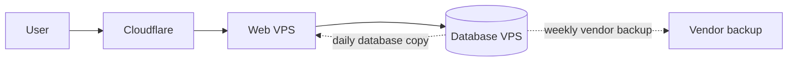

# Production Infrastructure Cost

**Status:** Proposed  
**Audience:** CEO, product owner, and engineering team  
**Price check:** 26 September 2026

## Purpose

This document estimates the production infrastructure cost for one to three years.

It excludes development, features, staging, product QA, and data migration.

## Lean recommendation

Use two Vietnix VPS Cheap 2 servers. Use one server for the website and one for PostgreSQL. Store uploaded files on the Web VPS local disk.

This keeps web and database failures separate. It removes S3, paid monitoring, paid Cloudflare, and daily human checks.

## Planning assumptions

- Traffic is about 600 sessions per day.
- Each VPS has 2 CPU, 4 GB RAM, and 40 GB SSD.
- The existing domain is used at no extra cost.
- Uploaded files are served from the Web VPS local disk.
- Vietnix provides one automatic VPS backup each week.
- Database backups run daily and are copied to the other VPS.
- Monitoring and alerts use free self-hosted tools.
- Support runs during agreed business hours.
- Incidents are billed only when they happen.
- Required maintenance is 6 hours per month.
- Production setup is 28 hours plus 4 contingency hours.
- Infrastructure engineering work is charged at VND 100,000 per hour.
- VPS cost uses a fixed planning price of VND 250,000 per server per month. It excludes term discounts, coupons, and new-customer promotions.
- Long-term tables use a 10% VAT budget. Eligible invoices issued before 31 December 2026 may use 8% VAT.

## Cost classification

### Required

| Item | Type | Cost basis |
|---|---|---|
| Web VPS Cheap 2 | Recurring | Fixed planning price |
| Database VPS Cheap 2 | Recurring | Fixed planning price |
| Production setup | One-time | 32 engineering hours |
| Lean maintenance | Recurring | 6 engineering hours/month |
| Existing domain | Recurring | VND 0 additional cost |
| Local file storage | Recurring | Included in Web VPS |
| Weekly vendor backup | Recurring | Included in VPS plan |
| Self-hosted monitoring | Recurring | VND 0 vendor cost |
| Cloudflare Free | Recurring | VND 0 |
| Existing mailbox, registry, and CI service | Recurring | VND 0 additional cost |

### Optional

| Item | When required | Cost basis |
|---|---|---|
| Incident response | An incident occurs | Actual engineering hours |
| Incident reserve | The business wants a fixed reserve | 4 engineering hours/month |
| 24/7 on-call coverage | A 15-minute SEV-1 response is required | 30 engineering hours/month planning allowance |
| Cloudflare Pro | More security controls are required | USD 20/month on an annual plan |
| Hosted monitoring | Self-hosted monitoring is not accepted | VND 1 million/month planning allowance |
| VPS upgrade | Load or storage exceeds the agreed limit | Vendor price difference |
| External backup storage | Weekly vendor backup is not enough | Vendor price by storage use |

## Required VPS cost

| Item | 1 year | 2 years | 3 years |
|---|---:|---:|---:|
| One VPS per month | VND 250,000 | VND 250,000 | VND 250,000 |
| Two VPS for the full term | VND 6 million | VND 12 million | VND 18 million |
| VAT budget at 10% | VND 600,000 | VND 1.2 million | VND 1.8 million |
| **VPS total** | **VND 6.6 million** | **VND 13.2 million** | **VND 19.8 million** |

The VND 250,000 value is a conservative planning price. The totals assume the same price for the full term and do not use promotional discounts.

## Required production setup

| Work | Hours |
|---|---:|
| Provision servers and access | 1 |
| Harden operating systems and firewall | 4 |
| Configure Cloudflare, TLS, and reverse proxy | 4 |
| Configure PostgreSQL | 3 |
| Configure local file storage and permissions | 2 |
| Configure backup and test restore | 4 |
| Configure monitoring, logs, and alerts | 3 |
| Configure deployment and rollback | 3 |
| Prepare runbooks and handover | 2 |
| Run production verification | 2 |
| Base setup | 28 |
| Contingency | 4 |
| **Total setup** | **32 hours** |

| Rate | Before VAT | VAT at 10% | Setup total |
|---:|---:|---:|---:|
| VND 100,000/hour | VND 3.2 million | VND 320,000 | **VND 3.52 million** |

## Required lean maintenance

Automated checks run continuously. Human work is reduced to two reviews each month and one quarterly recovery exercise.

| Work | Average hours/month |
|---|---:|
| Review alerts, capacity, logs, and backup status twice each month | 2 |
| Apply planned updates and verify backup restore each month | 2 |
| Run a six-hour recovery exercise each quarter | 2 |
| **Total** | **6 hours/month** |

| Rate | 1 year | 2 years | 3 years |
|---:|---:|---:|---:|
| VND 100,000/hour | VND 7.92 million | VND 15.84 million | VND 23.76 million |

These values include the 10% VAT budget.

## Required production budget

This total includes two VPS servers, one-time setup, lean maintenance, quarterly recovery exercises, and VAT. Domain and S3 cost are zero.

| Rate | 1 year | 2 years | 3 years |
|---:|---:|---:|---:|
| VND 100,000/hour | **VND 18.04 million** | **VND 32.56 million** | **VND 47.08 million** |

The required budget is:

- **One year:** VND 18.04 million.
- **Two years:** VND 32.56 million.
- **Three years:** VND 47.08 million.

The first-year cost contains:

| Cost | Amount |
|---|---:|
| Two VPS servers | VND 6.6 million |
| One-time setup | VND 3.52 million |
| Twelve months of maintenance | VND 7.92 million |
| **First-year total** | **VND 18.04 million** |

## Cheapest one-server alternative

Use one VPS Cheap 2 for the website, PostgreSQL, and local files. This reduces setup to 28 hours and maintenance to 5 hours per month.

| Rate | 1 year | 2 years | 3 years |
|---:|---:|---:|---:|
| VND 100,000/hour | VND 12.98 million | VND 22.88 million | VND 32.78 million |

One server saves about VND 5.06 million in the first year. A server failure stops the website and database together. Use this option only when minimum cost is more important than service isolation.

## Optional cost

Optional items are not part of the required budget.

| Item | Assumption | 1 year | 2 years | 3 years |
|---|---|---:|---:|---:|
| Incident reserve | 4 hours/month at VND 100,000/hour, VAT included | VND 5.28 million | VND 10.56 million | VND 15.84 million |
| 24/7 on-call | 30 hours/month at VND 100,000/hour, VAT included | VND 39.6 million | VND 79.2 million | VND 118.8 million |
| Cloudflare Pro | USD 20/month, VND 27,000/USD, 10% tax buffer | VND 7.128 million | VND 14.256 million | VND 21.384 million |
| Hosted monitoring | VND 1 million/month plus VAT | VND 13.2 million | VND 26.4 million | VND 39.6 million |

Do not include these items in the customer quote unless the customer selects them.

### Optional Cloudflare Pro budget

Cloudflare Pro is optional. The estimate uses the USD 20 monthly price for annual billing, an exchange rate of VND 27,000 per USD, and a 10% tax and exchange-rate buffer.

| Cost | 1 year | 2 years | 3 years |
|---|---:|---:|---:|
| Cloudflare Pro | VND 7.128 million | VND 14.256 million | VND 21.384 million |
| Required production budget | VND 18.04 million | VND 32.56 million | VND 47.08 million |
| **Required plus Cloudflare Pro** | **VND 25.168 million** | **VND 46.816 million** | **VND 68.464 million** |

The actual VND charge follows the invoice exchange rate and tax treatment. Cloudflare Free remains the default required plan.

## Accepted cost and risk trade-offs

| Cost reduction | Saving | Accepted impact |
|---|---:|---|
| Use the existing domain | VND 558,000 in year one | No impact if ownership and renewal are valid |
| Do not purchase S3 | VND 0 current cost | No daily off-provider backup |
| Serve uploaded files locally | No storage service cost | Web VPS disk limits file capacity |
| Use VPS Cheap 2 | About 46% below the NVMe 2 monthly list price | Lower disk and network performance |
| Automate checks | Reduce maintenance from 19 to 6 hours/month | No daily human review |
| Use business-hours support | No on-call fee | No guaranteed response outside support hours |
| Bill incidents when used | No fixed incident reserve | Incident months may cost more |
| Use free monitoring and Cloudflare | No subscription cost | Fewer support and security features |

## Backup risk

Vietnix states that the VPS plan includes one automatic backup each week and retains the latest copy on a separate backup server. This keeps vendor cost at zero.

The vendor also recommends that customers keep their own additional backup. Without S3 or another external location:

- Maximum file loss may reach seven days.
- Only the latest vendor backup may be available.
- A provider-wide or account-wide incident can affect production and recovery access.

The business owner must accept this risk. Add external backup storage later when the value of the stored data is higher than the storage cost.

## Approval decision

The business owner must select:

- Two-server lean recommendation or one-server cheapest option.
- Contract term: one, two, or three years.
- Business support hours.
- Whether weekly vendor backup is enough.
- Whether incidents are billed only when they occur.

## References

- [Deployment options](../deployments/README.md)
- [Option 1 architecture](../deployments/option-1-single-server/architecture.md)
- [Option 2 architecture](../deployments/option-2-two-servers/architecture.md)
- [Maintenance work and cost](../maintainances/maintenance-work-and-cost.md)
- [Incident response](../maintainances/incident-response.md)
- [Vietnix VPS pricing and included weekly backup](https://vietnix.vn/vps/)
- [Vietnix VPS backup guide](https://vietnix.vn/backup-du-lieu-vps/)
- [Cloudflare pricing](https://www.cloudflare.com/plans/)
- [Vietnam VAT reduction through 2026](https://baochinhphu.vn/giam-thue-gia-tri-gia-tang-tu-01-7-2025-den-het-31-12-2026-10225070118590677.htm)
