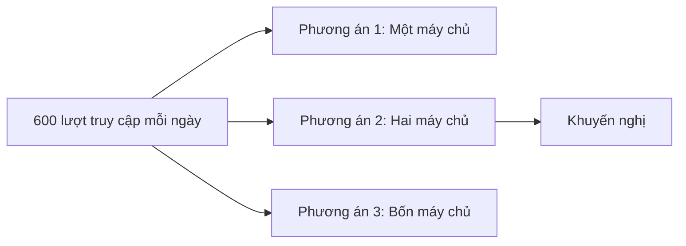

# Các phương án chạy website Insumart

**Trạng thái:** Đề xuất

**Đối tượng đọc:** CEO, chủ sản phẩm và đội kỹ thuật

**Ngày kiểm tra giá:** 26 tháng 9 năm 2026

## Tóm tắt

- **Mục tiêu:** Giữ chi phí hợp lý, giảm thời gian website bị dừng và có cách phục hồi khi máy chủ gặp lỗi.
- **Khuyến nghị:** Dùng Phương án 2. Website và PostgreSQL chạy trên hai VPS riêng.
- **Chi phí năm đầu:** **47,6 triệu VND**.
- **Từ năm thứ hai:** Khoảng **39,6 triệu VND/năm** nếu giá VPS và phí bảo trì không đổi.

## So sánh nhanh

| Phương án | Chi phí năm đầu | Rủi ro dừng toàn bộ | Công quản lý | Quyết định |
|---|---:|---|---|---|
| [Một máy chủ](./option-1-single-server/architecture.md) | 36,7 triệu VND | Cao | Thấp | Chỉ dùng khi cần tiết kiệm nhất |
| [Hai máy chủ](./option-2-two-servers/architecture.md) | 47,6 triệu VND | Trung bình | Trung bình | **Khuyến nghị** |
| [Bốn máy chủ](./option-3-separate-services/architecture.md) | 78 triệu VND | Trung bình | Cao | Chưa cần dùng |

Các số trên gồm VPS, cài đặt ban đầu, bảo trì một năm và VAT theo kế hoạch. Không gồm việc phát sinh, trực 24/7, Cloudflare Pro hoặc nơi sao lưu bên ngoài Vietnix.

## Vì sao chọn Phương án 2

- Lưu lượng hiện tại còn thấp. Chưa cần chia hệ thống thành quá nhiều phần.
- PostgreSQL chạy riêng. Lỗi website khó dùng hết tài nguyên của cơ sở dữ liệu.
- Chi phí năm đầu chỉ cao hơn Phương án 1 là 10,9 triệu VND.
- Khi có lỗi, việc tìm nguyên nhân và phục hồi vẫn đơn giản.
- Có thể thêm VPS Web thứ hai sau này mà không phải làm lại toàn bộ.

Tách nhiều dịch vụ không tự làm hệ thống ổn định hơn. Nếu mỗi dịch vụ vẫn chỉ có một máy chủ, máy chủ đó hỏng thì dịch vụ vẫn dừng.

## Chi phí Phương án 2

| Hạng mục | Chi phí năm đầu |
|---|---:|
| Hai VPS, đã gồm VAT | 6,6 triệu VND |
| Cài đặt ban đầu | 8 triệu VND |
| Bảo trì một năm, đã gồm VAT | 33 triệu VND |
| **Tổng** | **47,6 triệu VND** |

Phí bảo trì là 2,5 triệu VND/tháng trước VAT. Công việc ngoài gói có giá 300.000 VND/giờ cho mọi khung giờ.

## Việc bắt buộc cho mọi phương án

- Đặt **Cloudflare Free** trước website.
- Bật chống DDoS, tường lửa web và giới hạn số lần gọi khi gói Free hỗ trợ.
- Ẩn IP gốc của Vietnix khi có thể.
- Chỉ cho phép Cloudflare truy cập các cổng web.
- Bảo vệ trang quản trị bằng Cloudflare Access hoặc danh sách IP được phép.
- Bật xác thực hai bước cho tài khoản quản trị.
- Không mở PostgreSQL hoặc Redis ra Internet.
- Sao lưu PostgreSQL hằng ngày.
- Với phương án nhiều máy chủ, chép bản sao lưu sang VPS khác.
- Dùng thêm bản sao lưu hằng tuần có sẵn của Vietnix.
- Thử khôi phục dữ liệu mỗi tháng.
- Theo dõi website, CPU, bộ nhớ, ổ đĩa và trạng thái sao lưu.

Cloudflare Free đủ cho giai đoạn đầu. Cloudflare Pro chỉ là lựa chọn thêm và được tính riêng trong [tài liệu chi phí](../costs/README.md).

## Khi nào cần nâng cấp máy chủ

Mỗi VPS bắt đầu với ít nhất **2 CPU và 4 GB RAM**. Mức này đủ khoảng trống cho lúc lượng truy cập tăng, phát hành bản mới, sao lưu và bảo trì.

Cấu hình ban đầu giả định ứng dụng chính viết bằng Go, trang khách hàng và trang quản trị đã được tạo sẵn trước khi đưa lên máy chủ, và không xử lý video hoặc ảnh nặng.

Chỉ nâng cấp khi có một trong các dấu hiệu sau:

- CPU thường xuyên trên 70% khi lượng truy cập bình thường.
- Bộ nhớ thường xuyên trên 80% hoặc máy chủ phải dùng ổ đĩa làm bộ nhớ tạm.
- Ổ đĩa đã dùng đến 70%.
- API chậm hơn rõ rệt khi lượng truy cập bình thường.
- Kiểm thử tải không đạt mức đã thống nhất.

## Mục tiêu cần doanh nghiệp duyệt

| Mục tiêu kỹ thuật | Mức đề xuất |
|---|---|
| Phục hồi web sau khi bắt đầu xử lý | Trong vòng 60 phút |
| Phục hồi cơ sở dữ liệu sau khi bắt đầu xử lý | Trong vòng 4 giờ |
| Dữ liệu cơ sở dữ liệu có thể mất ở Phương án 2 và 3 | Tối đa 24 giờ |
| Dữ liệu có thể mất ở Phương án 1 | Tối đa 7 ngày |
| Tệp tải lên có thể mất | Tối đa 7 ngày |
| Quay lại bản phát hành cũ | Trong vòng 15 phút |

Gói bảo trì chỉ cam kết phản hồi trong 8 giờ làm việc đã thống nhất. Các mốc phục hồi trên được tính từ khi bắt đầu xử lý và không phải lời bảo đảm.

## Điều chưa rõ cần xác nhận

- **Lượng truy cập:** Chưa biết lúc đông nhất có bao nhiêu người dùng cùng lúc. Cần kiểm thử tải trước khi mở cho khách hàng.
- **Dữ liệu:** Chưa biết kích thước cơ sở dữ liệu và tệp hiện tại. Cần kiểm tra trước khi mua VPS.
- **Mạng:** Cần hỏi Vietnix về mạng riêng giữa hai VPS. Nếu không có, phải giới hạn IP và mã hóa kết nối cơ sở dữ liệu.
- **Tệp:** Tệp tải lên được lưu trên VPS Web và nằm trong bản sao lưu hằng tuần.
- **Sao lưu:** Chưa có bản sao bên ngoài Vietnix. Chủ doanh nghiệp phải chấp nhận rủi ro này hoặc mua thêm nơi lưu.
- **Hỗ trợ:** Cần ghi rõ khung giờ hỗ trợ trong hợp đồng.

## Nguồn giá

- [Bảng giá VPS Vietnix](https://vietnix.vn/vps/)
- [Gói dịch vụ và bảng giá Cloudflare](https://www.cloudflare.com/plans/)
- [Hướng dẫn chống DDoS của Cloudflare](https://developers.cloudflare.com/ddos-protection/get-started/)
