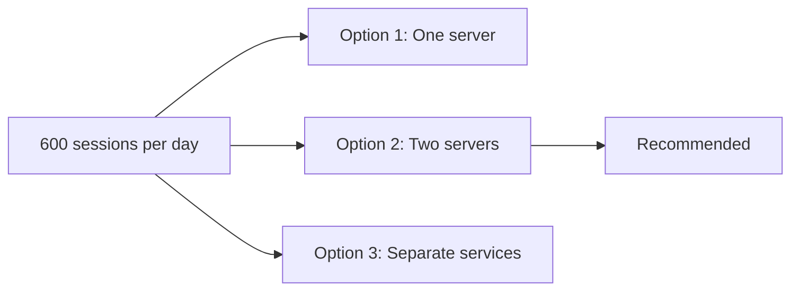

# Insumart Website Deployment Options

**Status:** Proposed  
**Audience:** CEO, product owner, and engineering team  
**Price check:** 26 September 2026

## TL;DR

- **Goal:** Control cost, reduce downtime, and recover quickly after a failure.
- **Recommendation:** Use Option 2. Keep web services and PostgreSQL on separate VPS servers.
- **Expected cost:** About **VND 500,000/month**, before VAT.

## Options at a glance

| Option | Estimated total per month | Downtime risk | Operating work | Decision |
|---|---:|---|---|---|
| [One server](./option-1-single-server/architecture.md) | VND 250,000 | High | Low | Use only when cost is the main concern |
| [Two servers](./option-2-two-servers/architecture.md) | VND 500,000 | Medium | Medium | **Recommended** |
| [Separate services](./option-3-separate-services/architecture.md) | VND 1 million | Medium | High | Defer |

The estimates use a fixed planning price of VND 250,000 per VPS per month and Cloudflare Free. They do not use promotions. They exclude VAT, paid monitoring, migration, and engineering support. The existing domain adds no cost.

## Why Option 2 is recommended

- The traffic is small. Microservices add cost and work without a clear business return.
- PostgreSQL is separated from web processes. A web fault cannot directly consume all database resources.
- The price difference from Option 1 is VND 250,000 per month.
- Recovery is simpler than Option 3.
- The system can add a second Web VPS later without a full redesign.

Microservices do not create high availability by themselves. A critical service still stops when its only server fails. High availability needs duplicate instances and a load balancer.

## Controls required for every option

- Put **Cloudflare Free** in front of all public traffic.
- Enable the DDoS, WAF, bot, and rate-limit controls available on the Free plan.
- Hide the Vietnix origin IP where possible. Allow Cloudflare IP ranges on web ports.
- Protect the admin site with Cloudflare Access or an IP allow-list and multi-factor authentication.
- Never expose PostgreSQL or Redis to the public Internet.
- Back up PostgreSQL daily. For multi-server options, copy the backup to another VPS.
- Use the included weekly vendor backup. Test restore every month.
- Monitor website health, CPU, memory, disk, database connections, and backup status.

Cloudflare Free is enough for launch. Cloudflare Pro is optional and has a planning budget of about VND 594,000 per month, including the exchange-rate and tax buffer defined in the [production cost estimate](../costs/README.md).

## When to increase resources

Every VPS starts with at least **2 CPU and 4 GB RAM**. This gives the operating system and services more safe capacity during traffic spikes, deployments, backups, and maintenance.

The initial size assumes a Go backend, static client and admin sites, no builds on the server, and no heavy media processing.

Increase resources only when monitoring shows one of these conditions:

- CPU stays above 70% during normal traffic.
- Memory stays above 80% or the server uses swap often.
- Disk usage reaches 70%.
- API response time becomes slower under normal traffic.
- A load test fails the agreed peak traffic target.

## Business targets to approve

| Target | Initial proposal |
|---|---|
| Web recovery after server failure | Within 60 minutes |
| Database recovery after server failure | Within 4 hours |
| Maximum database loss for Options 2 and 3 | Up to 24 hours |
| Maximum data loss for Option 1 | Up to 7 days |
| Maximum uploaded-file loss | Up to 7 days |
| Bad release rollback | Within 15 minutes |

The daily database copy targets up to 24 hours of database loss. The weekly vendor backup may lose up to seven days. Add external backup storage when this risk is not acceptable.

## Assumptions and open questions

- **Traffic:** 600 sessions per day is known, but peak traffic is unknown. Run a load test before launch.
- **Data:** Current database and file sizes are unknown. Confirm them before buying storage.
- **Network:** Confirm whether Vietnix VPS products support private networking. Otherwise use IP allow-lists and encrypted database traffic.
- **Files:** Store uploaded files on the Web VPS local disk. Monitor disk use and include files in the weekly vendor backup.
- **Backup:** There is no off-provider backup. The business owner must accept the provider-wide recovery risk.
- **Recovery:** The CEO must approve the recovery and data-loss targets above.

## Price references

- [Vietnix VPS pricing](https://vietnix.vn/vps/)
- [Cloudflare plans and pricing](https://www.cloudflare.com/plans/)
- [Cloudflare DDoS protection guide](https://developers.cloudflare.com/ddos-protection/get-started/)
