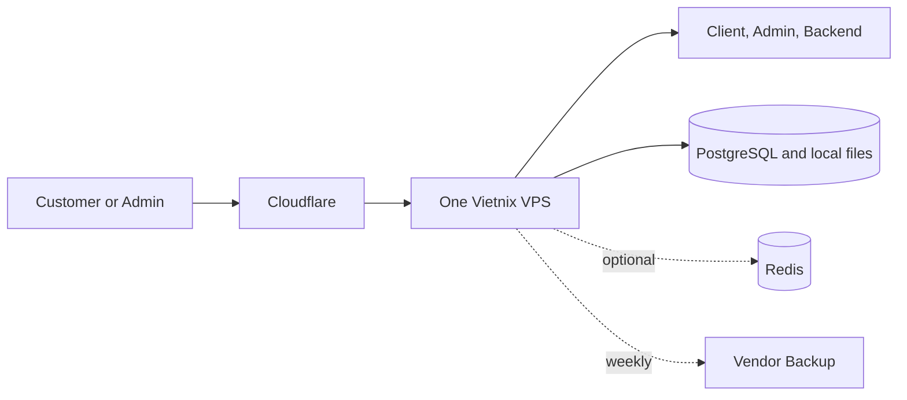

# Option 1: One Server

**Status:** Considered  
**Best for:** Lowest initial cost

## TL;DR

- **Goal:** Run the full website on one Vietnix VPS.
- **Benefit:** Lowest server cost and simplest operation.
- **Risk:** One server failure stops the website and database together.

## Architecture

Use separate containers for the client site, admin site, backend, PostgreSQL, and optional Redis. Containers reduce software conflicts, but they do not protect against a VPS failure.

## Suggested size

- **Vietnix VPS Cheap 2:** 2 CPU, 4 GB RAM, 40 GB SSD.
- Start without Redis. Add it only when measurements show a clear need.
- Store uploaded files on the VPS local disk.
- Use the included weekly vendor backup.
- Build the client and admin sites in CI, not on the VPS.

## Cost estimate

| Item | Monthly cost |
|---|---:|
| One VPS planning price | VND 250,000 |
| Cloudflare Free | VND 0 |
| **Estimated total** | **VND 250,000** |

The planning price excludes VAT and promotions.

## Failure impact

| Failure | Business impact |
|---|---|
| Client or admin process fails | One web area may stop |
| Backend fails | Website actions stop |
| PostgreSQL fails | All data functions stop |
| VPS fails | The full system stops |
| Disk is damaged | Application and database may be lost together |

## Recovery

- Restart failed containers automatically.
- Keep the last stable application images in a separate registry.
- Create a new VPS from documented configuration after a server failure.
- Restore PostgreSQL and uploaded files from the latest available backup.
- Target full recovery within 4 hours.
- Test the full restore every month.

## When to upgrade

Move to a larger VPS only when CPU stays above 70%, memory stays above 80%, swap is used often, or a load test fails. Move to Option 2 when database and web processes compete for the same resources.

> **Warning**
> This option has one failure point. It is not suitable when several hours of full website downtime would cause material loss.

## Decision

Choose this option only when the lowest cost is more important than service isolation. It saves VND 250,000 per month compared with Option 2, but a server failure stops the full system.
