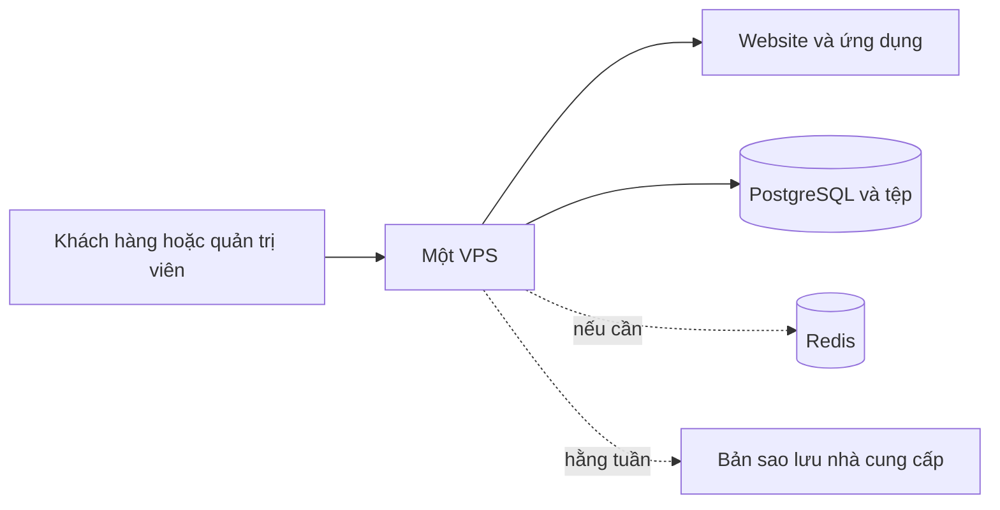

# Phương án 1: Một máy chủ

**Trạng thái:** Đã xem xét

**Phù hợp khi:** Cần chi phí thấp nhất

## Tóm tắt

- **Cách làm:** Chạy toàn bộ website trên một VPS.
- **Lợi ích:** Rẻ nhất và dễ quản lý nhất.
- **Rủi ro:** VPS hỏng thì website và cơ sở dữ liệu cùng dừng.
- **Chi phí năm đầu:** **36,7 triệu VND**.

## Sơ đồ

Website, trang quản trị, ứng dụng chính và PostgreSQL chạy riêng bên trong cùng một VPS. Cách này giúp phần mềm ít ảnh hưởng lẫn nhau, nhưng không giúp ích khi cả VPS bị lỗi.

## Cấu hình đề xuất

- **Cấu hình VPS:** 2 CPU, 4 GB RAM và 40 GB SSD.
- Chưa dùng Redis ở giai đoạn đầu.
- Lưu tệp tải lên trên ổ đĩa của VPS.
- Dùng bản sao lưu hằng tuần của nhà cung cấp.
- Tạo sẵn trang khách hàng và trang quản trị trước khi đưa lên VPS.

## Chi phí

| Hạng mục | Mức giá |
|---|---:|
| Một VPS, trước VAT | 250.000 VND/tháng |
| Bảo trì, trước VAT | 2 triệu VND/tháng |
| Cài đặt ban đầu | 7 triệu VND |
| **Tổng năm đầu, theo VAT kế hoạch** | **36,7 triệu VND** |

Công việc ngoài gói được báo giá theo nhu cầu và phải được khách hàng duyệt trước.

## Khi có lỗi

| Lỗi | Tác động |
|---|---|
| Trang khách hàng hoặc trang quản trị bị lỗi | Một phần website có thể dừng |
| Ứng dụng chính bị lỗi | Các thao tác trên website dừng |
| PostgreSQL bị lỗi | Mọi chức năng dùng dữ liệu dừng |
| VPS bị lỗi | Toàn bộ hệ thống dừng |
| Ổ đĩa bị hỏng | Có thể mất cả ứng dụng và cơ sở dữ liệu |

## Cách phục hồi

- Tự động chạy lại phần mềm bị lỗi.
- Giữ bản ứng dụng ổn định gần nhất ở nơi khác.
- Dựng VPS mới từ hướng dẫn đã viết.
- Khôi phục PostgreSQL và tệp từ bản sao lưu mới nhất.
- Cố gắng phục hồi toàn bộ trong vòng 4 giờ sau khi bắt đầu xử lý.
- Thử phục hồi mỗi tháng.

Gói bảo trì cam kết phản hồi trong 30 phút thuộc khung giờ hỗ trợ đã thống nhất. Mục tiêu 4 giờ được tính từ khi bắt đầu xử lý.

## Khi nào cần đổi phương án

Nâng cấp VPS khi CPU thường xuyên trên 70%, bộ nhớ trên 80%, máy chủ thường xuyên phải dùng ổ đĩa làm bộ nhớ tạm hoặc kiểm thử tải không đạt.

Chuyển sang Phương án 2 khi website và cơ sở dữ liệu tranh nhau tài nguyên hoặc doanh nghiệp không chấp nhận việc cả hệ thống dừng cùng lúc.

> **Cảnh báo**
> Phương án này có một điểm lỗi duy nhất. Không phù hợp nếu website dừng vài giờ sẽ gây thiệt hại lớn.

## Quyết định

Chỉ chọn phương án này khi tiết kiệm chi phí quan trọng hơn việc tách riêng website và cơ sở dữ liệu. Phương án tiết kiệm 8,15 triệu VND trong năm đầu so với Phương án 2.
