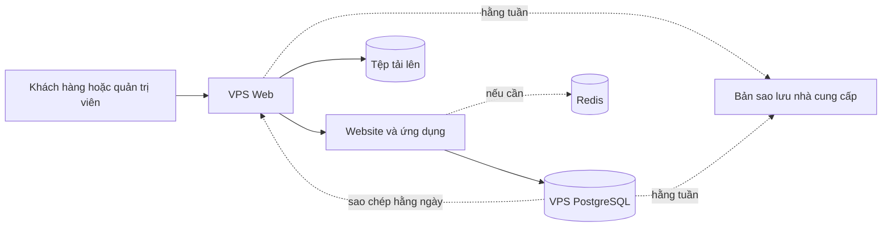

# Phương án 2: Tách máy chủ web và cơ sở dữ liệu

**Trạng thái:** Khuyến nghị

**Phù hợp khi:** Cần cân bằng chi phí, an toàn và cách quản lý đơn giản

## Tóm tắt

- **Cách làm:** Website và PostgreSQL chạy trên hai VPS riêng.
- **Lợi ích:** Lỗi website khó làm hết tài nguyên của cơ sở dữ liệu.
- **Rủi ro:** Mỗi VPS vẫn có thể bị lỗi và cần cách phục hồi rõ ràng.
- **Chi phí năm đầu:** **44,85 triệu VND**.

## Sơ đồ

VPS Web là cửa vào công khai duy nhất. PostgreSQL chỉ nhận kết nối từ VPS Web. Nếu sau này cần Redis, Redis vẫn đặt trên VPS Web cho đến khi có số liệu cho thấy cần máy riêng.

## Cấu hình đề xuất

| Máy chủ | Cấu hình | Công việc |
|---|---|---|
| VPS Web | 2 CPU, 4 GB RAM, 40 GB SSD | Website, trang quản trị, ứng dụng chính và tệp tải lên |
| VPS cơ sở dữ liệu | 2 CPU, 4 GB RAM, 40 GB SSD | Chỉ chạy PostgreSQL |

Ứng dụng chính được viết bằng Go. Trang khách hàng và trang quản trị được tạo sẵn trước khi đưa lên VPS. Sau khi mở cho khách hàng hoặc chạy chương trình quảng cáo, cần xem lại CPU, bộ nhớ, ổ đĩa và các câu lệnh cơ sở dữ liệu chạy chậm.

## Chi phí

| Hạng mục | Chi phí năm đầu |
|---|---:|
| Hai VPS, đã gồm VAT | 6,6 triệu VND |
| Cài đặt ban đầu | 5,25 triệu VND |
| Bảo trì một năm, đã gồm VAT | 33 triệu VND |
| **Tổng** | **44,85 triệu VND** |

Phí bảo trì là 2,5 triệu VND/tháng trước VAT. Công việc ngoài gói được báo giá theo nhu cầu và phải được khách hàng duyệt trước.

## Khi có lỗi

| Lỗi | Tác động | Mục tiêu sau khi bắt đầu xử lý |
|---|---|---|
| Một phần ứng dụng bị lỗi | Một chức năng có thể dừng | Dưới 5 phút nếu chỉ cần chạy lại |
| VPS Web bị lỗi | Website và trang quản trị dừng | Trong vòng 60 phút |
| VPS cơ sở dữ liệu bị lỗi | Các chức năng dùng dữ liệu dừng | Trong vòng 4 giờ |
| Bản phát hành mới bị lỗi | Phiên bản mới không ổn định | Quay lại bản cũ trong 15 phút |

Sao lưu cơ sở dữ liệu hằng ngày sang VPS Web. Dùng thêm bản sao lưu hằng tuần của nhà cung cấp và thử khôi phục mỗi tháng. Giữ hướng dẫn cài đặt và bản ứng dụng ổn định ở nơi khác.

Gói bảo trì cam kết phản hồi trong 30 phút thuộc khung giờ hỗ trợ đã thống nhất. Các mục tiêu trong bảng được tính từ khi bắt đầu xử lý.

## Bảo mật

- Chỉ nhận truy cập công khai trên cổng 80 và 443.
- Chỉ cho phép IP tin cậy hoặc VPN dùng SSH.
- Chỉ cho phép VPS Web kết nối PostgreSQL.
- Mã hóa kết nối cơ sở dữ liệu nếu nhà cung cấp không có mạng riêng.
- Bảo vệ trang quản trị bằng danh sách IP được phép hoặc VPN.

## Khi cần mở rộng

Chỉ nâng cấp khi CPU thường xuyên trên 70%, bộ nhớ trên 80%, máy chủ thường xuyên phải dùng ổ đĩa làm bộ nhớ tạm hoặc kiểm thử tải không đạt.

Thêm VPS Web thứ hai và bộ chia lưu lượng khi doanh nghiệp không còn chấp nhận một giờ dừng website. Chỉ thêm bản sao PostgreSQL khi cần phục hồi cơ sở dữ liệu nhanh hơn.

## Quyết định

**Dùng phương án này khi mở cho khách hàng.** Chi phí năm đầu cao hơn Phương án 1 là 8,15 triệu VND nhưng website và cơ sở dữ liệu được tách riêng. Phương án cũng dễ quản lý hơn việc chia thành bốn máy chủ.
