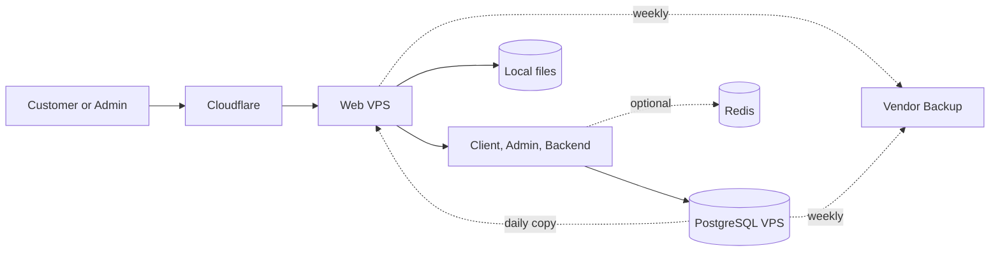

# Option 2: Separate Web and Database Servers

**Status:** Recommended  
**Best for:** Balanced cost, safety, and simple operation

## TL;DR

- **Goal:** Isolate PostgreSQL from public web services.
- **Benefit:** A web fault does not directly consume database resources.
- **Risk:** Each server is still a single failure point and needs a recovery plan.

## Architecture

Cloudflare is the only public entry point. PostgreSQL accepts traffic only from the Web VPS. Redis, if added later, stays on the Web VPS unless measurements show that it needs separate resources.

## Suggested size

| Server | Vietnix plan | Workload |
|---|---|---|
| Web VPS | Cheap 2: 2 CPU, 4 GB RAM, 40 GB SSD | Client, admin, backend, local files, reverse proxy |
| Database VPS | Cheap 2: 2 CPU, 4 GB RAM, 40 GB SSD | PostgreSQL only |

This size assumes a Go backend and static client and admin sites. Build frontend assets in CI. Review CPU, memory, disk use, and slow queries after launch and after marketing campaigns.

## Cost estimate

| Item | Monthly cost |
|---|---:|
| Web VPS planning price | VND 250,000 |
| Database VPS planning price | VND 250,000 |
| Cloudflare Free | VND 0 |
| **Estimated total** | **VND 500,000** |

The planning price excludes VAT and promotions.

## Failure impact and recovery

| Failure | Impact | Target recovery |
|---|---|---|
| Application process | One function may stop | Under 5 minutes |
| Web VPS | Public site and admin stop | Within 60 minutes |
| Database VPS | Data functions stop | Within 4 hours |
| Bad release | New version is unstable | Roll back within 15 minutes |

Create a daily database backup on the Web VPS. Use the included weekly vendor backup and run a monthly restore test. Keep deployment configuration and application images outside both VPS servers.

## Security

- Accept public traffic on ports 80 and 443 through Cloudflare only.
- Limit SSH to trusted IPs or VPN access.
- Allow PostgreSQL only from the Web VPS.
- Use encrypted database connections if private networking is not available.
- Put the admin site behind Cloudflare Access or an IP allow-list.

## Growth path

Upgrade only when CPU stays above 70%, memory stays above 80%, swap is used often, or a load test fails. Use a larger Web VPS if the frontend needs server-side rendering or the backend runs heavy jobs.

Add a second Web VPS and a load balancer when one hour of web downtime is no longer acceptable. Add PostgreSQL replication only when the business also needs faster database recovery.

## Decision

**Use this option for launch.** It gives useful isolation for VND 250,000 more per month than Option 1 and avoids the operating cost of Option 3.
