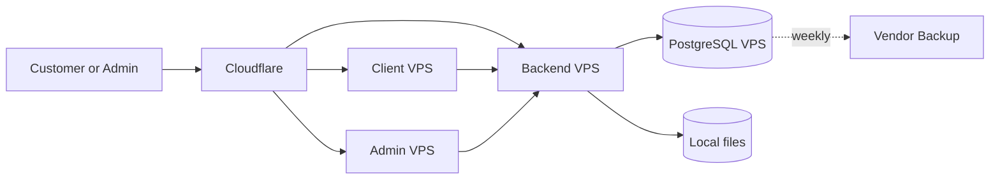

# Option 3: Separate Services

**Status:** Deferred  
**Best for:** Larger systems with independent teams and release cycles

## TL;DR

- **Goal:** Put client, admin, backend, and PostgreSQL on separate servers.
- **Benefit:** A failure can affect a smaller part of the system.
- **Risk:** Cost and operating work increase, but each service is still a single failure point.

## Architecture

Redis can use another VPS when it becomes required. This layout separates infrastructure. A true microservice design also needs clear business boundaries, separate releases, and service contracts. Those details cannot be defined until the backend design is known.

## Suggested minimum size

| Server | Vietnix plan | Monthly cost |
|---|---|---:|
| Client VPS | Cheap 2: 2 CPU, 4 GB RAM | VND 250,000 |
| Admin VPS | Cheap 2: 2 CPU, 4 GB RAM | VND 250,000 |
| Backend VPS | Cheap 2: 2 CPU, 4 GB RAM | VND 250,000 |
| Database VPS | Cheap 2: 2 CPU, 4 GB RAM | VND 250,000 |

## Cost estimate

| Item | Monthly cost |
|---|---:|
| Four Vietnix VPS servers | VND 1 million |
| Cloudflare Free | VND 0 |
| **Estimated total without Redis** | **VND 1 million** |
| Optional Redis VPS | Add VND 250,000 |

The planning price excludes VAT and promotions. A real high-availability setup costs more because critical services need duplicate instances and a load balancer.

## Failure impact

| Failure | Business impact |
|---|---|
| Client VPS | Public website stops; admin may remain available |
| Admin VPS | Admin stops; public website may remain available |
| Backend VPS | Most website and admin actions stop |
| Database VPS | All data functions stop |

The backend and database remain central failure points. Splitting the two frontends does not keep the business running when either central component fails.

## Operating impact

- More servers need patching, monitoring, firewall rules, and deployment work.
- More network links create more failure cases.
- Troubleshooting takes longer.
- Separate release pipelines are needed.
- Capacity is underused at the current traffic level.

Increase a service only when its own monitoring shows sustained CPU above 70%, memory above 80%, frequent swap use, or failed load-test targets.

## Decision

Do not use this option for launch. Reconsider it when traffic, team size, or release independence creates a measured need. For higher availability, first add a second Web VPS to Option 2 instead of splitting every component.
