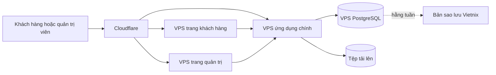

# Phương án 3: Tách thành bốn máy chủ

**Trạng thái:** Chưa cần dùng

**Phù hợp khi:** Hệ thống lớn hơn và có nhiều nhóm làm việc độc lập

## Tóm tắt

- **Cách làm:** Trang khách hàng, trang quản trị, ứng dụng chính và PostgreSQL chạy trên bốn VPS riêng.
- **Lợi ích:** Một lỗi có thể chỉ ảnh hưởng đến một phần nhỏ hơn.
- **Rủi ro:** Tốn nhiều tiền và công quản lý hơn, nhưng mỗi VPS vẫn có thể bị lỗi.
- **Chi phí năm đầu:** **78 triệu VND**.

## Sơ đồ

Redis có thể dùng thêm một VPS khi thật sự cần. Việc dùng nhiều VPS chỉ tách máy chủ. Để chia ứng dụng thành nhiều dịch vụ nhỏ, còn cần xác định rõ phần việc, cách phát hành và cách các dịch vụ trao đổi dữ liệu. Chưa thể làm việc đó khi chưa có thiết kế chi tiết của ứng dụng.

## Cấu hình tối thiểu

| Máy chủ | Gói Vietnix | Giá trước VAT mỗi tháng |
|---|---|---:|
| VPS trang khách hàng | Cheap 2: 2 CPU, 4 GB RAM | 250.000 VND |
| VPS trang quản trị | Cheap 2: 2 CPU, 4 GB RAM | 250.000 VND |
| VPS ứng dụng chính | Cheap 2: 2 CPU, 4 GB RAM | 250.000 VND |
| VPS cơ sở dữ liệu | Cheap 2: 2 CPU, 4 GB RAM | 250.000 VND |

## Chi phí

| Hạng mục | Chi phí năm đầu |
|---|---:|
| Bốn VPS, đã gồm VAT | 13,2 triệu VND |
| Cài đặt ban đầu | 12 triệu VND |
| Bảo trì một năm, đã gồm VAT | 52,8 triệu VND |
| **Tổng** | **78 triệu VND** |

Phí bảo trì là 4 triệu VND/tháng trước VAT. Công việc ngoài gói có giá 300.000 VND/giờ cho mọi khung giờ.

Nếu dùng thêm VPS Redis, chi phí VPS tăng khoảng 3,3 triệu VND mỗi năm sau VAT. Hệ thống có máy dự phòng thật sự sẽ tốn nhiều hơn vì cần thêm VPS và bộ chia lưu lượng.

## Khi có lỗi

| Lỗi | Tác động |
|---|---|
| VPS trang khách hàng | Website công khai dừng; trang quản trị có thể vẫn chạy |
| VPS trang quản trị | Trang quản trị dừng; website công khai có thể vẫn chạy |
| VPS ứng dụng chính | Hầu hết thao tác trên website và trang quản trị dừng |
| VPS cơ sở dữ liệu | Mọi chức năng dùng dữ liệu dừng |

Ứng dụng chính và cơ sở dữ liệu vẫn là hai điểm lỗi quan trọng. Tách hai trang web không giúp doanh nghiệp tiếp tục hoạt động khi một trong hai phần này dừng.

## Công quản lý

- Có bốn máy chủ cần cập nhật, theo dõi và cài tường lửa.
- Có nhiều kết nối mạng hơn nên có thêm loại lỗi.
- Tìm nguyên nhân lỗi mất nhiều thời gian hơn.
- Cần quy trình phát hành riêng cho từng phần.
- Nhiều tài nguyên chưa được dùng hết ở mức truy cập hiện tại.

Chỉ nâng cấp một VPS khi CPU thường xuyên trên 70%, bộ nhớ trên 80%, máy chủ thường xuyên phải dùng ổ đĩa làm bộ nhớ tạm hoặc kiểm thử tải không đạt.

## Quyết định

Không dùng phương án này ở giai đoạn đầu. Chỉ xem lại khi lượng truy cập, số người trong đội hoặc nhu cầu phát hành riêng đã tăng rõ ràng.

Nếu cần website ổn định hơn, trước tiên nên thêm VPS Web thứ hai vào Phương án 2 thay vì tách mọi phần thành máy chủ riêng.
