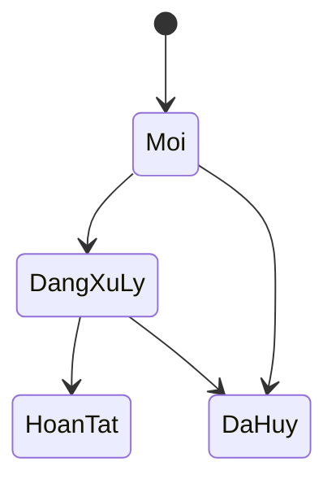

# Admin: Quản lý đơn hàng

## Tóm tắt

- **Mục tiêu:** Cho phép đội vận hành tìm, xem và xử lý đơn hàng.
- **Độ phức tạp:** Cao.
- **Estimate:** 52 giờ, 5,2 triệu VND trước VAT.

## Phạm vi

- Danh sách, tìm kiếm và lọc đơn hàng.
- Chi tiết khách hàng, địa chỉ, hàng hóa và tổng tiền.
- Bốn trạng thái: mới, đang xử lý, hoàn tất và đã hủy.
- Ghi chú thanh toán, giao hàng và ghi chú nội bộ.
- Lịch sử thay đổi trạng thái đơn.
- Không cho chuyển trạng thái sai quy tắc.

## Estimate

| Công việc | Giờ | Chi phí |
|---|---:|---:|
| Danh sách, tìm kiếm và lọc | 12 | 1,2 triệu |
| Chi tiết đơn hàng | 16 | 1,6 triệu |
| Chuyển trạng thái và ghi chú | 16 | 1,6 triệu |
| Lịch sử trạng thái và kiểm tra dữ liệu | 8 | 800.000 VND |
| **Tổng** | **52** | **5,2 triệu** |

## Không gồm

- Xuất đơn hàng.
- Kết nối thanh toán, giao hàng và hoàn tiền tự động.
- Quy trình duyệt hoặc trạng thái tùy chỉnh.
