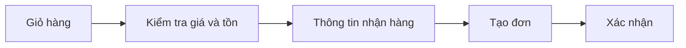

# Client: Giỏ hàng và đặt hàng

## Tóm tắt

- **Page tham chiếu:** [Giỏ hàng](https://insumart.vn/cart), [thanh toán](https://insumart.vn/checkout).
- **Độ phức tạp:** Cao.
- **Estimate:** 60 giờ, 6 triệu VND trước VAT.

## Phạm vi

- Xem, thêm, xóa và sửa số lượng trong giỏ hàng.
- Kiểm tra lại giá, tồn kho và số lượng trước khi tạo đơn.
- Nhập thông tin nhận hàng và ghi chú.
- Chọn chuyển khoản hoặc thanh toán khi nhận hàng.
- Đặt hàng không cần tài khoản.
- Tạo đơn một lần, kể cả khi khách gửi lại yêu cầu.
- Page xác nhận đặt hàng thành công.
- Email xác nhận đơn hàng.

## Estimate

| Công việc | Giờ | Chi phí |
|---|---:|---:|
| Giỏ hàng | 16 | 1,6 triệu |
| Thông tin nhận hàng và thanh toán thủ công | 20 | 2 triệu |
| Tạo đơn an toàn và chống trùng | 16 | 1,6 triệu |
| Xác nhận, email và lỗi cơ bản | 8 | 800.000 VND |
| **Tổng** | **60** | **6 triệu** |

## Điểm cần chốt

- Cách tính phí giao hàng đơn giản cho MVP.
- Nội dung hướng dẫn chuyển khoản.

## Không gồm

- Cổng thanh toán và hoàn tiền tự động.
- API giao hàng, theo dõi vận đơn và nhiều cách tính phí.
