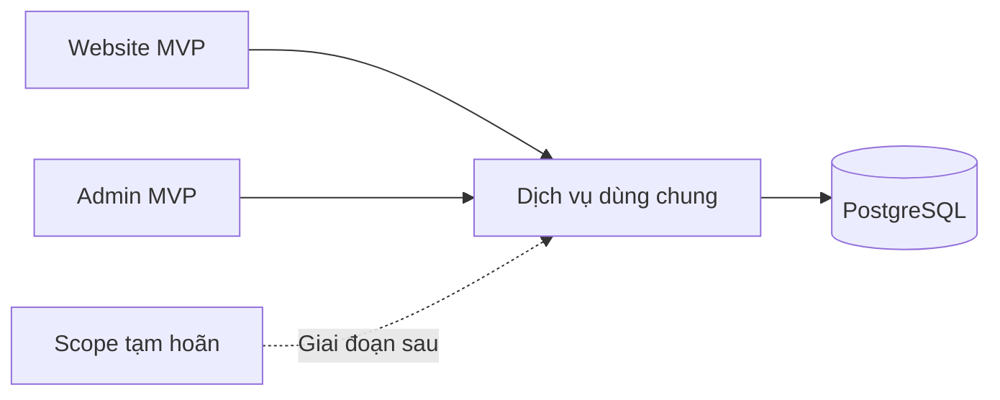
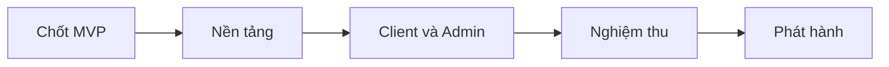

# Phạm vi MVP và chi phí xây lại Insumart

**Trạng thái:** Estimate sơ bộ đã rút gọn

**Đối tượng đọc:** Chủ sản phẩm, đơn vị báo giá và đội kỹ thuật

**Ngày cập nhật:** 30 tháng 9 năm 2026

## Tóm tắt

- **Mục tiêu:** Phát hành website bán hàng và trang quản trị ở mức đủ dùng.
- **Phạm vi tính giá:** Build Client và Build Admin theo phương án MVP.
- **Công sức cơ sở:** 396 giờ, tương đương 9,9 người-tuần.
- **Chi phí cơ sở:** 39,6 triệu VND trước VAT; 43,56 triệu VND sau VAT 10%.
- **Ngân sách dự kiến:** Khoảng 47,9 triệu VND sau VAT, đã cộng dự phòng 10%.
- **Trần mục tiêu:** 50 triệu VND sau VAT nếu các giả định bên dưới không đổi.
- **Lịch dự kiến:** 8–10 tuần với hai kỹ sư toàn thời gian, QA và quản lý dự án bán thời gian.

Client và Admin dùng chung backend. Không làm chức năng riêng khi có thể dùng lại cùng dữ liệu và luồng xử lý.

## Chi phí tổng

| Phần | Giờ | Người-tuần | Trước VAT | Sau VAT 10% |
|---|---:|---:|---:|---:|
| [Build Client MVP](./client-pages/) | 168 | 4,2 | 16,8 triệu | 18,48 triệu |
| [Build Admin MVP](./admin-pages/) | 228 | 5,7 | 22,8 triệu | 25,08 triệu |
| [Migrate Data](./data-migrations/) | Chưa tính | Chưa tính | Chưa tính | Chưa tính |
| **Tổng cơ sở** | **396** | **9,9** | **39,6 triệu** | **43,56 triệu** |
| **Dự phòng 10%** | **39,6** | **1** | **3,96 triệu** | **4,356 triệu** |
| **Ngân sách dự kiến** | **435,6** | **10,9** | **43,56 triệu** | **47,916 triệu** |

Một người-tuần bằng 40 giờ. Tiền được tính theo đơn giá quy đổi **100.000 VND/giờ**. Đây là cơ sở estimate, chưa phải báo giá cố định.

## Build Client MVP

| Scope | Cách rút gọn | Giờ | Trước VAT |
|---|---|---:|---:|
| [Nền tảng giao diện](./client-pages/01-shared-ui.md) | Bỏ yêu thích và trạng thái ít dùng | 16 | 1,6 triệu |
| [Trang chủ](./client-pages/02-home.md) | Dùng khối cố định và thành phần có sẵn | 12 | 1,2 triệu |
| [Danh mục và tìm kiếm](./client-pages/03-product-discovery.md) | Một mẫu danh sách, bộ lọc cơ bản | 28 | 2,8 triệu |
| [Chi tiết sản phẩm](./client-pages/04-product-detail.md) | Một mẫu sản phẩm, không có yêu thích | 24 | 2,4 triệu |
| [Giỏ hàng và đặt hàng](./client-pages/05-cart-checkout.md) | Checkout không cần đăng nhập, thanh toán thủ công | 60 | 6 triệu |
| [Tài khoản khách hàng](./client-pages/06-customer-account.md) | Tạm hoãn | 0 | 0 |
| [Tin tức](./client-pages/07-content-pages.md) | Bỏ chia sẻ, page 404 riêng và nội dung liên quan | 16 | 1,6 triệu |
| [Các trang nội dung tĩnh](./client-pages/08-about.md) | Dùng chung một mẫu cho giới thiệu, thương hiệu, FAQ, liên hệ và chính sách | 12 | 1,2 triệu |
| **Tổng Build Client** |  | **168** | **16,8 triệu** |

## Build Admin MVP

| Scope | Cách rút gọn | Giờ | Trước VAT |
|---|---|---:|---:|
| [Đăng nhập và tổng quan](./admin-pages/01-auth-dashboard.md) | Tổng quan cơ bản, không có audit log chung | 28 | 2,8 triệu |
| [Sản phẩm, giá và tồn kho](./admin-pages/02-product-catalog.md) | Gộp catalog, giá và tồn kho; bỏ biến thể và thao tác hàng loạt | 92 | 9,2 triệu |
| [Quản lý đơn hàng](./admin-pages/04-orders.md) | Trạng thái đơn cơ bản, không tích hợp hoàn tiền và giao hàng | 52 | 5,2 triệu |
| [Quản lý khách hàng](./admin-pages/05-customers.md) | Tạm hoãn; tra cứu khách trong đơn hàng | 0 | 0 |
| [Nội dung và trang chủ](./admin-pages/06-content-home.md) | Mẫu cố định, không làm page builder | 44 | 4,4 triệu |
| [Người dùng và phân quyền](./admin-pages/07-users-permissions.md) | Hai vai trò cố định | 12 | 1,2 triệu |
| [Cấu hình và tích hợp](./admin-pages/08-settings-integrations.md) | Tạm hoãn; cấu hình khi triển khai | 0 | 0 |
| **Tổng Build Admin** |  | **228** | **22,8 triệu** |

## Phần được gộp để tránh làm trùng

- Giá, tồn kho và giá khuyến mãi nằm trong form sản phẩm.
- Thông tin khách hàng được xem từ chi tiết đơn hàng.
- Giới thiệu, thương hiệu, FAQ, liên hệ và chính sách dùng một mẫu nội dung tĩnh.
- Thông tin doanh nghiệp được quản lý cùng nội dung website.
- Không làm lại chức năng audit ở từng module. MVP chỉ giữ lịch sử trạng thái đơn hàng.

## Phần tạm hoãn

- Đăng ký, đăng nhập, hồ sơ, địa chỉ và lịch sử đơn của khách hàng.
- Danh sách yêu thích.
- Cổng thanh toán, API giao hàng, hoàn tiền tự động và theo dõi vận đơn.
- Biến thể sản phẩm, nhập hoặc xuất hàng loạt và quản lý nhiều kho.
- Bộ máy khuyến mãi theo nhiều điều kiện.
- Quản lý khách hàng riêng.
- Ma trận quyền tùy chỉnh và audit log toàn hệ thống.
- Page builder, xem trước nội dung và lịch xuất bản.
- Page 404 thiết kế riêng, nút chia sẻ nội dung và bài viết liên quan.
- Toàn bộ công việc Migrate Data.

Các phần này cần estimate riêng nếu đưa trở lại phạm vi.

## Lịch dự kiến

| Giai đoạn | Thời gian lịch dự kiến |
|---|---:|
| Chốt giao diện, dữ liệu và quy tắc đặt hàng | 1 tuần |
| Nền tảng và dữ liệu dùng chung | 1–2 tuần |
| Build Client và Admin | 4–5 tuần |
| Kiểm thử và nghiệm thu | 1–2 tuần |
| Phát hành và theo dõi | 1 tuần |
| **Tổng** | **8–10 tuần** |

## Giả định để giữ ngân sách

- Khách đặt hàng không cần tài khoản.
- Thanh toán bằng chuyển khoản hoặc thanh toán khi nhận hàng. Không kết nối cổng thanh toán.
- Phí giao hàng được nhập thủ công hoặc dùng một quy tắc đơn giản đã chốt.
- Email xác nhận dùng một dịch vụ gửi thư đã có sẵn. Không có màn hình cấu hình riêng.
- Mỗi sản phẩm có một mã hàng, một giá và một trạng thái tồn kho.
- Admin có hai vai trò cố định: quản trị và nhân viên.
- Nội dung dùng các mẫu cố định. Không có trình dựng page tự do.
- Backend, API và kiểm thử trong phạm vi đã nằm trong giờ tương ứng.
- Có sẵn nội dung, hình ảnh, thông tin sản phẩm và tài khoản dịch vụ cần dùng.
- Chi phí sau thuế dùng giả định VAT 10%.

## Chưa gồm

- Phí hạ tầng, vận hành và dịch vụ bên thứ ba.
- Nhập dữ liệu cũ và nhập nội dung thủ công.
- Thiết kế lại thương hiệu hoặc viết lại nội dung.
- Ứng dụng di động.
- ERP, CRM, kế toán, kho ngoài và sàn nhiều nhà cung cấp.

## Điểm cần chốt

- Xác nhận website chỉ nhận đơn bằng chuyển khoản hoặc thanh toán khi nhận hàng.
- Xác nhận cách tính phí giao hàng đơn giản cho MVP.
- Xác nhận sản phẩm không có biến thể và không quản lý nhiều kho.
- Xác nhận hai vai trò Admin cố định.
- Xác nhận dữ liệu cũ không nằm trong báo giá này.

Nếu một giả định thay đổi, hai bên cần estimate lại scope bị ảnh hưởng trước khi chốt giá.

## Tài liệu tham khảo

- [Website Insumart](https://insumart.vn/)
- [Chi phí hạ tầng và vận hành](../costs/README.md)
