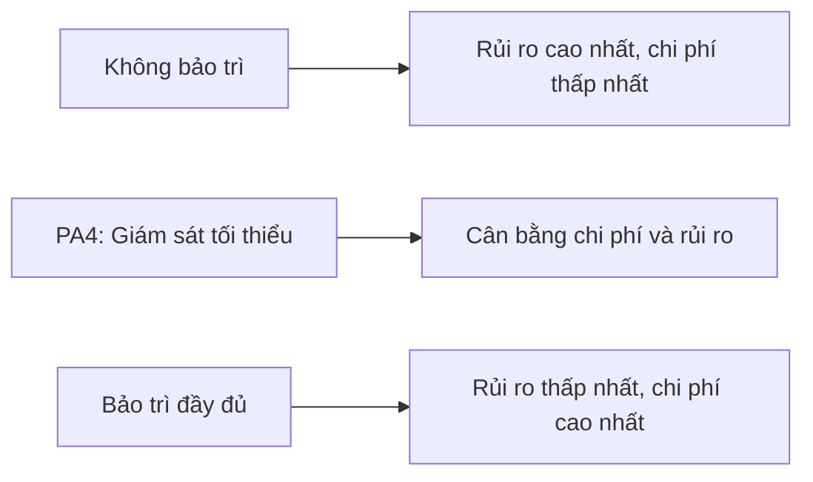

# Phương án 4: Giám sát tối thiểu (rút gọn chi phí vận hành)

**Trạng thái:** Đề xuất

**Đối tượng đọc:** CEO, chủ sản phẩm và đội kỹ thuật

## Tóm tắt

- **Cách làm:** Giữ lại cảnh báo tự động, kiểm tra tệp sao lưu tự động và vá bảo mật theo quý. Bỏ phần việc cần con người làm thủ công định kỳ.
- **Lợi ích:** Giảm hơn 70% chi phí bảo trì định kỳ so với gói đầy đủ.
- **Nhược điểm:** Không có cam kết thời gian phản hồi, không thử khôi phục dữ liệu thật, không có báo cáo định kỳ, vá bảo mật thưa hơn.
- **Chi phí năm đầu:** **23,84 triệu VND**, so với 47,6 triệu VND của gói bảo trì đầy đủ.

> **Cảnh báo**
> Gói này không xác nhận được bản sao lưu có thật sự khôi phục được hay không, vì không có bước thử khôi phục hằng tháng. Đây là rủi ro lớn nhất của PA4 và chủ doanh nghiệp phải chấp nhận rủi ro này khi chọn phương án.

## Bối cảnh

Chủ doanh nghiệp cân nhắc bỏ hẳn phí bảo trì định kỳ, chỉ trả phí cài đặt ban đầu và trả thêm theo giờ khi hệ thống có sự cố. Cách này giảm chi phí cố định hằng tháng, nhưng cũng bỏ luôn phần phát hiện sự cố sớm và kiểm tra bản sao lưu. Với một hệ thống bán hàng, hậu quả là rủi ro mất dữ liệu đơn hàng và thời gian dừng dịch vụ kéo dài không kiểm soát được, có thể gây thiệt hại lớn hơn nhiều so với số tiền tiết kiệm được.

Tài liệu này đề xuất một phương án ở giữa: giữ lại phần việc rẻ và có thể tự động hóa, bỏ phần việc cần nhiều công người, để giảm chi phí mà vẫn giữ được hai lớp bảo vệ quan trọng nhất: phát hiện sự cố sớm và bản sao lưu dùng được khi cần.

## Không thuộc phạm vi

- Không thay đổi hạ tầng đề xuất. Tài liệu vẫn dùng hai VPS theo [Kiến trúc Phương án 2](../deployments/option-2-two-servers/architecture.md).
- Không thay đổi đơn giá việc phát sinh (300.000 VND/giờ) đã thống nhất ở nơi khác.

## So sánh ba phương án

| Phương án | Chi phí năm đầu* | Chi phí từ năm 2* | Phát hiện sự cố sớm | Backup được kiểm tra | Cam kết thời gian phản hồi |
|---|---:|---:|---|---|---|
| Không bảo trì | 14,6 triệu VND | 6,6 triệu VND | Không | Không | Không |
| **PA4 – Giám sát tối thiểu (đề xuất)** | **23,84 triệu VND** | **15,84 triệu VND** | Có, tự động | Có, kiểm tra tự động | Không cam kết, cố gắng trong giờ hành chính |
| Bảo trì đầy đủ (hiện tại) | 47,6 triệu VND | 39,6 triệu VND | Có, tự động và xem xét thủ công | Có, kiểm tra tự động và thử khôi phục thật mỗi tháng | Trong 8 giờ làm việc đã thống nhất |

*Tính trên hạ tầng Phương án 2 (hai VPS), gồm VPS, cài đặt ban đầu và bảo trì, đã gồm VAT. Không gồm việc phát sinh khi có sự cố thật.

## Nội dung gói PA4

### Bảo vệ trước tấn công: cái gì không đổi, cái gì bị giảm

- **Không đổi dù chọn PA4:** Cloudflare Free chặn DDoS và giới hạn lưu lượng bất thường ở lớp biên. Lớp này được cấu hình một lần trong phí cài đặt ban đầu, chạy tự động 24/7, không phụ thuộc gói bảo trì nào. PA4 vẫn chặn được các kiểu tấn công dồn dập (DDoS, dò mật khẩu hàng loạt) như gói đầy đủ.
- **Bị giảm ở PA4:** vá bảo mật hệ điều hành dời sang mỗi quý thay vì mỗi tháng, và bỏ hẳn việc xem xét thủ công "đăng nhập sai và lưu lượng lạ" hai lần một tháng. Nếu kẻ tấn công khai thác một lỗ hổng phần mềm chưa vá hoặc một kiểu xâm nhập tinh vi (không phải DDoS ồn ào), PA4 phát hiện chậm hơn và cửa sổ rủi ro dài hơn.

PA4 không đảm bảo mức an toàn ngang gói đầy đủ trước mọi kiểu tấn công — chỉ đảm bảo lớp phòng thủ tự động cơ bản vẫn hoạt động bình thường.

### Được giữ lại

| Công việc | Cách làm | Vì sao giữ lại |
|---|---|---|
| Cảnh báo hoạt động của website, API và VPS | Công cụ tự động kiểm tra định kỳ, báo qua tin nhắn hoặc email khi có lỗi | Chi phí thấp, gần như không tốn công người, phát hiện sự cố sớm hơn việc chờ khách hàng báo |
| Kiểm tra tệp sao lưu PostgreSQL hằng ngày | Script tự động kiểm tra tệp có được tạo ra và có dung lượng hợp lý | Phát hiện sớm khi tác vụ sao lưu bị dừng hoặc lỗi rõ ràng |
| Vá bảo mật hệ điều hành | Gộp thành một đợt mỗi quý thay vì mỗi tháng | Vẫn đóng phần lớn lỗ hổng đã biết, giảm số lần cần người thực hiện |
| Xử lý sự cố khi được báo | Tính theo giờ phát sinh, 300.000 VND/giờ, mọi khung giờ | Giữ nguyên như hợp đồng bảo trì hiện tại |

### Bị bỏ so với gói bảo trì đầy đủ

- Xem xét thủ công hai lần mỗi tháng (nhật ký, tài nguyên, truy vấn chậm).
- Báo cáo ngắn hằng tháng cho khách hàng.
- Thử khôi phục dữ liệu thật mỗi tháng.
- Diễn tập phục hồi mỗi quý.
- Cam kết thời gian phản hồi 8 giờ làm việc.

## Chi phí

| Hạng mục | Trước VAT/tháng | Sau VAT/tháng | Sau VAT/năm |
|---|---:|---:|---:|
| PA4 – Giám sát tối thiểu | 700.000 VND | 770.000 VND | **9,24 triệu VND** |

### Chi phí khi có sự cố

Phí PA4 không gồm thời gian xử lý sự cố. Khi có lỗi, dù xảy ra ban ngày, buổi tối, cuối tuần hay ngày lễ, chi phí tính theo cùng một công thức:

> Chi phí sự cố = số giờ xử lý x 300.000 VND + chi phí của nhà cung cấp khác

- Đơn giá 300.000 VND/giờ áp dụng chung cho mọi khung giờ, không có phụ phí ngoài giờ.
- Tính theo mỗi 30 phút, như quy định ở [Quy trình xử lý sự cố](./incident-response.md).
- Không cam kết thời gian phản hồi không có nghĩa là miễn phí xử lý ngoài giờ — chỉ có nghĩa là không cam kết mốc thời gian cụ thể để bắt đầu xử lý.

## Nhược điểm

- **Kiểm tra tệp sao lưu tự động không thay thế được thử khôi phục thật.** Một tệp sao lưu có thể tồn tại và có dung lượng hợp lý nhưng vẫn hỏng bên trong. Rủi ro backup không dùng được khi cần vẫn còn, chỉ giảm chứ không hết.
- **Không có cam kết thời gian phản hồi.** Khi có sự cố, thời gian nhận việc và xử lý là cố gắng trong giờ hành chính, không phải cam kết như gói đầy đủ. Sự cố ngoài giờ có thể phải chờ lâu hơn.
- **Không có báo cáo định kỳ.** Chủ doanh nghiệp phải chủ động hỏi tình trạng hệ thống thay vì được cập nhật hằng tháng.
- **Vá bảo mật thưa hơn.** Khoảng cách ba tháng giữa các đợt vá làm tăng thời gian hệ thống tồn tại lỗ hổng đã biết nhưng chưa được xử lý.
- **Không có diễn tập phục hồi hằng quý.** Khi có sự cố lớn thật sự, người xử lý ít được luyện tập trước nên dễ mất nhiều thời gian hơn ước tính.

## Khi nào nên quay lại gói bảo trì đầy đủ

- Hệ thống bắt đầu có doanh thu ổn định hoặc chạy chương trình khuyến mãi lớn.
- Từng xảy ra sự cố mà thời gian phát hiện hoặc phản hồi chậm gây thiệt hại rõ rệt.
- Khách hàng cuối yêu cầu cam kết thời gian phản hồi bằng văn bản trong hợp đồng với bên thứ ba.
- Traffic hoặc dữ liệu tăng đến mức cần theo dõi tài nguyên thường xuyên hơn.

## Nội dung cần chốt

- Ai là người nhận cảnh báo tự động: chủ doanh nghiệp, đội vận hành nội bộ hay dev.
- Có chấp nhận rủi ro không thử khôi phục thật hay muốn thêm một lần thử khôi phục mỗi năm.
- Thời gian phản hồi tối đa chấp nhận được dù không phải cam kết cứng.
- Ngưỡng traffic hoặc doanh thu nào thì tự động chuyển lại gói bảo trì đầy đủ.

## Tài liệu tham khảo

- [Công việc và chi phí bảo trì (gói đầy đủ)](./maintenance-work-and-cost.md)
- [Quy trình xử lý sự cố](./incident-response.md)
- [Chi phí vận hành hệ thống thật](../costs/README.md)
- [Kiến trúc Phương án 2](../deployments/option-2-two-servers/architecture.md)
