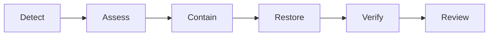
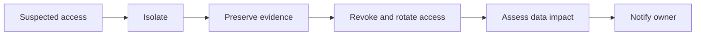

# Incident Response Process

**Status:** Proposed  
**Audience:** CEO, product owner, support team, and engineering team

## Purpose

This document defines how to handle a production incident for any deployment option. The goal is to limit business impact, restore service safely, and prevent a repeat.

## Response flow

First confirm the impact. Then stop further damage, restore service, verify business functions, and review the cause.

## Severity

| Level | Business impact | Examples |
|---|---|---|
| SEV-1 | The main service is unavailable, data may be lost, or a security breach is suspected | Full outage, database unavailable, confirmed unauthorized access |
| SEV-2 | A major function is unavailable or very slow | A main customer or admin action fails with no safe workaround |
| SEV-3 | Impact is limited and a safe workaround exists | One minor function fails or a non-urgent alert repeats |

The incident lead may raise or lower the level when the impact becomes clear.

## Proposed response targets

| Level | Initial response | Work period | Update frequency |
|---|---:|---|---:|
| SEV-1 | 15 minutes | Continuous until stable | Every 30 minutes |
| SEV-2 | 1 hour | Business hours unless impact grows | Every 60 minutes |
| SEV-3 | 1 business day | Planned work | When status changes |

The SEV-1 target requires paid 24/7 on-call coverage. Without that coverage, response starts during the agreed support hours.

The deployment documents propose these recovery targets:

- Bad release rollback: within 15 minutes.
- Option 1 full recovery: within 4 hours.
- Option 2 Web VPS recovery: within 60 minutes.
- Option 2 Database VPS recovery: within 4 hours.
- Maximum database loss: up to 24 hours with daily cross-server copies.
- Maximum file loss: up to 7 days with the included weekly vendor backup.

These are business targets, not guarantees. The CEO must approve them. Faster database recovery needs more frequent backups and more maintenance work.

## Roles

| Role | Main duty |
|---|---|
| Incident lead | Sets severity, assigns work, makes recovery decisions, and keeps the timeline |
| Technical responder | Finds the cause, contains the issue, restores service, and records changes |
| Business contact | Confirms business impact and sends updates to users and leaders |

One person may hold more than one role in a small team. The incident lead must still keep one clear record of decisions and actions.

## Process

### 1. Detect and record

- Open an incident record.
- Record the start time, detection source, affected functions, and known user impact.
- Assign the incident lead and technical responder.
- Set the first severity level.

### 2. Assess

- Check the public site, admin site, API, database, and recent alerts.
- Check whether a release, configuration change, traffic spike, or server fault happened near the start time.
- Decide which deployment components are affected.
- Do not change several parts at the same time.

### 3. Contain

- Stop a bad deployment or unsafe job.
- Roll back the last release when it is the likely cause.
- Limit harmful traffic when an attack is suspected.
- Isolate an affected server or account when unauthorized access is suspected.
- Preserve logs and other evidence for a security incident.

Containment may reduce features for a short time. The incident lead must record that decision and its business impact.

### 4. Restore

Use the smallest safe action:

1. Restart only the failed process when its state is safe.
2. Roll back to the last stable application image for a bad release.
3. Rebuild a failed VPS from the documented configuration.
4. Restore PostgreSQL from the daily cross-server copy or latest weekly vendor backup when the database cannot be recovered safely.

Do not delete damaged data or logs until the incident lead confirms that they are no longer needed for recovery or review.

### 5. Verify

- Confirm the public site, admin site, and API respond normally.
- Test the main customer and admin flows.
- Confirm database reads and writes work.
- Confirm monitoring and backup jobs are healthy.
- Watch error rate and resource use before closing the incident.
- Ask the business contact to confirm that the user impact is over.

### 6. Communicate and close

Each update must state:

- Current impact.
- Current severity.
- Work completed.
- Next action.
- Time of the next update.

The closing update must state the recovery time, known data loss, remaining risk, and follow-up owner.

## Security incident path

- Do not announce an unconfirmed cause.
- Revoke affected sessions, keys, or accounts after evidence is preserved.
- Ask the business owner and legal adviser to decide whether external notice is required.
- Never put secrets or personal data in the incident record.

## Post-incident review

Complete a review within two business days for SEV-1 and SEV-2 incidents. Record:

- A short impact summary.
- A factual timeline.
- The direct cause and contributing conditions.
- What detected the issue and what delayed recovery.
- Corrective actions, owners, and due dates.
- Monitoring, runbook, or architecture changes.

The review must focus on system and process gaps. It must not assign personal blame.

## Cost treatment

Routine maintenance hours do not include incident response. Track incident time from detection through verification and reporting.

> Incident cost = response hours x VND 100,000 + emergency vendor cost + VAT

The support contract must define:

- Support hours and time zone.
- Initial response targets.
- On-call fee.
- Whether the VND 100,000 hourly rate also applies after hours.
- Included incident hours, if any.
- Who can approve emergency cost.

## References

- [Maintenance work and cost](./maintenance-work-and-cost.md)
- [Deployment options and recovery targets](../deployments/README.md)
- [Option 1 recovery](../deployments/option-1-single-server/architecture.md)
- [Option 2 recovery](../deployments/option-2-two-servers/architecture.md)
- [Option 3 architecture](../deployments/option-3-separate-services/architecture.md)
