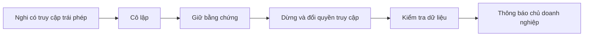

# Quy trình xử lý sự cố

**Trạng thái:** Đề xuất

**Đối tượng đọc:** CEO, chủ sản phẩm, đội hỗ trợ và đội kỹ thuật

## Mục đích

Tài liệu này hướng dẫn cách xử lý khi hệ thống đang phục vụ khách hàng gặp lỗi. Mục tiêu là giảm thiệt hại, đưa hệ thống hoạt động lại an toàn và tránh lặp lại lỗi cũ.

## Các bước chính

Trước tiên cần biết lỗi ảnh hưởng đến ai và phần nào. Sau đó ngăn lỗi lan rộng, khôi phục dịch vụ, kiểm tra chức năng chính và tìm cách tránh lặp lại.

## Mức độ sự cố

| Mức | Tác động | Ví dụ |
|---|---|---|
| Mức 1 - Khẩn cấp | Dịch vụ chính dừng, có thể mất dữ liệu hoặc nghi có người truy cập trái phép | Toàn bộ website dừng, cơ sở dữ liệu không dùng được |
| Mức 2 - Nghiêm trọng | Một chức năng chính dừng hoặc rất chậm | Khách hàng không thể hoàn tất thao tác chính |
| Mức 3 - Thông thường | Tác động nhỏ và có cách làm tạm | Một chức năng phụ bị lỗi |

Người phụ trách có thể đổi mức khi đã biết rõ tác động.

## Thời gian phản hồi

| Mức | Thời gian phản hồi | Cách làm |
|---|---:|---|
| Mức 1 | Trong 8 giờ làm việc đã thống nhất | Ưu tiên cao nhất khi đã nhận việc |
| Mức 2 | Trong 1 ngày làm việc | Xử lý trong khung giờ hỗ trợ |
| Mức 3 | Trong 2 ngày làm việc | Đưa vào kế hoạch |

Gói bảo trì không có trực 24/7. Ngoài giờ hỗ trợ, người phụ trách chỉ nhận việc khi có thể. Không có cam kết phản hồi trong 15 phút.

Các mục tiêu phục hồi kỹ thuật dưới đây được tính từ khi bắt đầu xử lý, không phải từ khi sự cố xảy ra:

- Quay lại bản phát hành cũ: trong vòng 15 phút nếu đã có sẵn bản ổn định.
- Phương án 1: cố gắng phục hồi toàn bộ trong vòng 4 giờ.
- Phương án 2: cố gắng phục hồi VPS Web trong vòng 60 phút.
- Phương án 2: cố gắng phục hồi VPS cơ sở dữ liệu trong vòng 4 giờ.
- Có thể mất tối đa 24 giờ dữ liệu cơ sở dữ liệu nếu dùng bản sao hằng ngày.
- Có thể mất tối đa 7 ngày dữ liệu tệp nếu chỉ dùng bản sao hằng tuần của Vietnix.

Đây là mục tiêu, không phải lời bảo đảm. Thời gian thật còn phụ thuộc nguyên nhân lỗi, tình trạng bản sao lưu và khả năng truy cập máy chủ.

## Người tham gia

| Vai trò | Việc chính |
|---|---|
| Người phụ trách sự cố | Xác định mức độ, chọn cách xử lý và ghi lại các quyết định |
| Người xử lý kỹ thuật | Tìm nguyên nhân, ngăn lỗi lan rộng và khôi phục hệ thống |
| Đầu mối kinh doanh | Xác nhận tác động và cập nhật thông tin cho khách hàng hoặc lãnh đạo |

Trong nhóm nhỏ, một người có thể làm nhiều vai trò. Tuy vậy, vẫn phải có một bản ghi chung về việc đã làm.

## Quy trình chi tiết

### 1. Ghi nhận sự cố

- Tạo bản ghi sự cố.
- Ghi thời gian bắt đầu, cách phát hiện và chức năng bị ảnh hưởng.
- Ghi tác động đã biết đến người dùng.
- Chỉ định người phụ trách và người xử lý kỹ thuật.
- Chọn mức độ ban đầu.

### 2. Đánh giá

- Kiểm tra website, trang quản trị, API, cơ sở dữ liệu và cảnh báo gần đây.
- Kiểm tra xem gần thời điểm xảy ra lỗi có phát hành bản mới, đổi cấu hình, tăng mạnh lưu lượng hoặc lỗi máy chủ hay không.
- Xác định phần nào đang bị ảnh hưởng.
- Không thay đổi nhiều phần cùng lúc.

### 3. Ngăn lỗi lan rộng

- Dừng bản phát hành lỗi hoặc tác vụ không an toàn.
- Quay lại bản cũ nếu bản mới có thể là nguyên nhân.
- Chặn lưu lượng có hại nếu nghi bị tấn công.
- Khóa máy chủ hoặc tài khoản bị ảnh hưởng nếu nghi có truy cập trái phép.
- Giữ lại nhật ký và bằng chứng nếu liên quan đến bảo mật.

Việc ngăn lỗi có thể tạm thời làm mất một số chức năng. Người phụ trách phải ghi lại quyết định và tác động.

### 4. Khôi phục

Ưu tiên cách làm nhỏ và an toàn nhất:

1. Chỉ khởi động lại phần bị lỗi.
2. Quay lại bản ứng dụng ổn định gần nhất.
3. Dựng lại VPS từ hướng dẫn đã có.
4. Khôi phục PostgreSQL từ bản sao hằng ngày trên VPS khác.
5. Dùng bản sao hằng tuần của Vietnix nếu không còn bản tốt hơn.

Không xóa dữ liệu hoặc nhật ký bị hỏng cho đến khi xác nhận chúng không còn cần để phục hồi hoặc tìm nguyên nhân.

### 5. Kiểm tra

- Xác nhận website, trang quản trị và API hoạt động.
- Thử các bước chính của khách hàng và quản trị viên.
- Xác nhận đọc và ghi cơ sở dữ liệu hoạt động.
- Xác nhận cảnh báo và sao lưu hoạt động.
- Theo dõi lỗi và tài nguyên trước khi đóng sự cố.
- Yêu cầu đầu mối kinh doanh xác nhận người dùng không còn bị ảnh hưởng.

### 6. Cập nhật và đóng sự cố

Mỗi lần cập nhật cần nêu:

- Tác động hiện tại.
- Mức độ hiện tại.
- Việc đã làm.
- Việc tiếp theo.
- Thời gian cập nhật tiếp theo.

Khi đóng sự cố, cần ghi thời gian phục hồi, dữ liệu đã mất nếu có, rủi ro còn lại và người phụ trách việc tiếp theo.

## Khi nghi có truy cập trái phép

- Không công bố nguyên nhân khi chưa xác nhận.
- Giữ bằng chứng trước khi khóa phiên, khóa truy cập hoặc tài khoản.
- Chủ doanh nghiệp và cố vấn pháp lý quyết định có cần thông báo ra bên ngoài hay không.
- Không ghi mật khẩu, mã truy cập hoặc dữ liệu cá nhân vào bản ghi sự cố.

## Xem lại sau sự cố

Với sự cố Mức 1 và Mức 2, nên xem lại trong vòng hai ngày làm việc. Nội dung gồm:

- Tác động chính.
- Dòng thời gian thực tế.
- Nguyên nhân trực tiếp và yếu tố liên quan.
- Cách phát hiện lỗi.
- Điều làm chậm việc phục hồi.
- Việc cần sửa, người phụ trách và hạn hoàn thành.
- Thay đổi cần có trong cảnh báo, hướng dẫn hoặc kiến trúc.

Việc xem lại tập trung vào hệ thống và cách làm, không quy lỗi cá nhân.

## Chi phí xử lý sự cố

Phí bảo trì thường kỳ không bao gồm thời gian xử lý sự cố ngoài gói.

> Chi phí sự cố = số giờ xử lý x 300.000 VND + chi phí của nhà cung cấp khác

Đơn giá **300.000 VND/giờ** áp dụng chung cho ban ngày, buổi tối, cuối tuần và ngày lễ.

- Tính theo mỗi 30 phút.
- Chỉ bắt đầu việc có tính phí sau khi khách hàng đồng ý, trừ khi hai bên đã thống nhất trước về trường hợp khẩn cấp.
- Không có phụ phí ngoài giờ.
- Không cam kết luôn có người nhận việc ngoài giờ.

## Nội dung hợp đồng cần ghi rõ

- Khung giờ hỗ trợ và múi giờ.
- Thời gian phản hồi.
- Người có quyền duyệt chi phí phát sinh.
- Cách xử lý trường hợp không liên lạc được người duyệt.
- Chi phí của nhà cung cấp khác.
- Mức dữ liệu có thể mất và thời gian phục hồi mong muốn.

## Tài liệu tham khảo

- [Công việc và chi phí bảo trì](./maintenance-work-and-cost.md)
- [Các phương án triển khai và mục tiêu phục hồi](../deployments/README.md)
- [Phục hồi Phương án 1](../deployments/option-1-single-server/architecture.md)
- [Phục hồi Phương án 2](../deployments/option-2-two-servers/architecture.md)
- [Kiến trúc Phương án 3](../deployments/option-3-separate-services/architecture.md)
