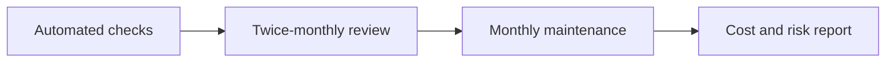

# Maintenance Work and Cost

**Status:** Proposed  
**Audience:** CEO, product owner, and engineering team

## Purpose

This document defines planned maintenance for all three deployment options. It also gives the CEO a simple way to estimate the monthly service fee.

It covers routine operations. It does not include feature work, releases, migrations, major upgrades, or incident response.

## Work cycle

Automated checks find urgent issues. Human reviews handle trends and follow-up work. Recovery exercises verify that the recovery steps still work.

## Automated work

Run these checks continuously:

| Work | Expected result |
|---|---|
| Check public website, admin site, and API health | Main services respond normally |
| Review active alerts and recent errors | New failures have an owner |
| Check CPU, memory, disk, and database connections | Usage stays below the agreed limits |
| Check the latest PostgreSQL backup | The backup job finished and the copy exists on the expected server |
| Review failed login and unusual traffic alerts | Security concerns are escalated |
| Record findings and follow-up work | The maintenance log is current |

Alerts notify the support contact. There is no scheduled daily human review.

## Twice-monthly work

Run these tasks twice each month:

| Work | Expected result |
|---|---|
| Review uptime, errors, and response time trends | Repeated issues are identified |
| Review CPU, memory, disk, and database growth | Capacity risks are found early |
| Review PostgreSQL slow queries and connection use | Database risks have follow-up actions |
| Check backup status | The daily database copy and latest weekly vendor backup are available |
| Review OS, container, and security updates | Safe updates are planned or applied |
| Review Cloudflare, firewall, and admin access rules | Public access remains limited |
| Check the last stable application images and deployment files | Rollback assets remain available |
| Send a short maintenance report | The CEO can see health, risk, work, and cost |

Updates that need downtime must use an approved maintenance window.

## Monthly work

- Restore PostgreSQL into a temporary isolated container and verify the data.
- Apply planned OS updates that need a restart.
- Review user access and remove access that is no longer needed.
- Review infrastructure cost and capacity.
- Review the recovery steps and update incorrect details.

## Quarterly work

- Run a full recovery exercise for the selected deployment option.
- Review recovery and data-loss targets with the business owner.
- Review old dependencies and plan major upgrades as separate work.
- Review whether the current deployment option still meets business needs.

## Planned effort

The estimate assumes that monitoring, alerts, backups, and deployment automation are already in place. It includes the monthly average of quarterly recovery work.

| Deployment option | Human reviews | Monthly work | Quarterly work average | Estimated total |
|---|---:|---:|---:|---:|
| Option 1: One server | 1.5 hours/month | 2 hours/month | 1.5 hours/month | **5 hours/month** |
| Option 2: Two servers | 2 hours/month | 2 hours/month | 2 hours/month | **6 hours/month** |
| Option 3: Separate services | 4 hours/month | 3 hours/month | 3 hours/month | **10 hours/month** |

The quarterly value is averaged across three months. Actual work is recorded in the month in which it runs.

Option 2 needs more work than Option 1 because the web and database servers are maintained separately. Option 3 needs the most work because it has four servers and more network links.

## Cost estimate

Use this formula:

> Monthly maintenance price = planned hours x engineering rate + on-call fee + paid tools + VAT

The estimate uses the agreed infrastructure engineering rate of VND 100,000 per hour.

| Deployment option | Hours/month | Before VAT | VAT at 10% | Total/month |
|---|---:|---:|---:|---:|
| Option 1: One server | 5 | VND 500,000 | VND 50,000 | **VND 550,000** |
| Option 2: Two servers | 6 | VND 600,000 | VND 60,000 | **VND 660,000** |
| Option 3: Separate services | 10 | VND 1 million | VND 100,000 | **VND 1.1 million** |

Incident work is billed separately unless the support contract includes it. A 24/7 response promise also needs a separate on-call fee. The on-call fee pays for availability. The contract must state whether it also includes incident hours.

## Cost changes

The estimate must be reviewed when any of these items change:

- More servers, databases, or environments are added.
- A paid monitoring or security tool is required.
- The business asks for 24/7 support or a shorter response time.
- Backup frequency or retention increases.
- Compliance reporting or security review is added.
- Traffic, data size, or incident frequency grows.

## Assumptions and open questions

- The engineering rate is VND 100,000 per hour.
- There is no daily human review. Alerts remain active outside business hours, but response starts within the agreed support hours.
- The CEO must select the on-call model.
- Monitoring, backup, and deployment automation setup is a separate one-time cost.
- The recovery targets in the deployment documents are still proposed and need business approval.

## References

- [Deployment options](../deployments/README.md)
- [Option 1 architecture](../deployments/option-1-single-server/architecture.md)
- [Option 2 architecture](../deployments/option-2-two-servers/architecture.md)
- [Option 3 architecture](../deployments/option-3-separate-services/architecture.md)
